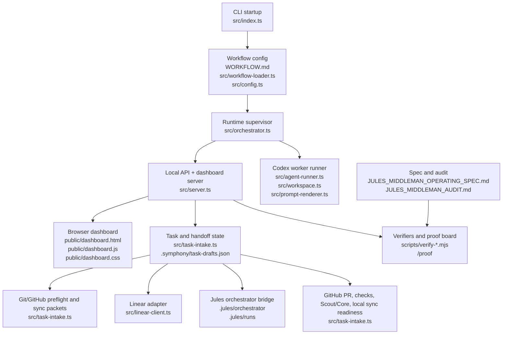

# Symphony/Jules Middleman Architecture

**Purpose**: map the files that make up Aralia's Symphony/Jules middleman system, so agents can understand ownership boundaries before editing code.

This file is the architectural index. It is not the behavioral spec and not the proof ledger:

- Use [`JULES_MIDDLEMAN_OPERATING_SPEC.md`](./JULES_MIDDLEMAN_OPERATING_SPEC.md) for required behavior, scenarios, blockers, and completion criteria.
- Use [`../JULES_MIDDLEMAN_AUDIT.md`](../JULES_MIDDLEMAN_AUDIT.md) for current implementation status, live proof, and remaining gaps.
- Use [`../README.md`](../README.md) for quick start and operator-facing entry points.

## System Role

Symphony is the local dashboard-first middleman around the existing Aralia Jules workflow. It is responsible for safe task intake, Git/GitHub readiness, Linear tracking, Jules handoff staging and launch, GitHub PR observation, Scout/Core readiness, local sync readiness, Codex worker observability, and proof capture.

Symphony is not meant to replace Jules or become an unbounded local implementation runner. Codex workers launched by Symphony are foremen by default: they inspect dashboard state, prepare bounded handoffs, monitor external progress, explain blockers, and update the operator trail.

## Architecture At A Glance



## Runtime Layers

### Startup And Configuration

Primary files:

- [`../src/index.ts`](../src/index.ts): CLI entry point. Parses workflow path, port, logs root, and `--dashboard-only`; starts the orchestrator and optional HTTP server.
- [`../WORKFLOW.md`](../WORKFLOW.md): real Aralia workflow configuration and prompt template.
- [`../WORKFLOW-mock.md`](../WORKFLOW-mock.md): mock tracker and mock Codex workflow for safe local verification.
- [`../src/workflow-loader.ts`](../src/workflow-loader.ts): loads Markdown front matter plus Liquid prompt template.
- [`../src/config.ts`](../src/config.ts): resolves typed config defaults and validates dispatch-time requirements.
- [`../src/types.ts`](../src/types.ts): shared domain types for issues, runtime state, workers, approvals, workflow config, and API-facing records.

Important boundary:

Startup should be safe for inspection. The dashboard and read-only APIs can start before worker dispatch is enabled. Dispatch-only dependencies such as tracker clients, workspace cleanup, and Codex app-server sessions are initialized lazily when the backend dispatch gate is enabled.

### Orchestration And Worker Dispatch

Primary files:

- [`../src/orchestrator.ts`](../src/orchestrator.ts): owns the poll loop, default-off dispatch state, candidate selection, worker assignment, retries, running-worker reconciliation, worker identity, Codex event retention, approval state, usage/rate-limit state, and `/api/v1/state` snapshot shape.
- [`../src/mock-client.ts`](../src/mock-client.ts): deterministic mock tracker used by safe verifier and smoke-test workflows.
- [`../src/linear-client.ts`](../src/linear-client.ts): Linear GraphQL adapter for real issue polling and status lookup.
- [`../src/workspace.ts`](../src/workspace.ts): per-issue workspace creation, cleanup, and workflow hooks.
- [`../src/agent-runner.ts`](../src/agent-runner.ts): Codex `app-server` subprocess client, thread/turn protocol handling, approval response bridge, and usage/rate-limit event capture.
- [`../src/prompt-renderer.ts`](../src/prompt-renderer.ts): renders the workflow prompt for each worker turn, including issue context, worker designation, and dashboard URL.

Important boundary:

`orchestrator.ts` is the only owner of live worker dispatch. The dashboard can request dispatch enable/disable through the API, but the backend decides whether ticks, retries, tracker polling, workspace cleanup, and worker launch may happen.

### Local API And Dashboard Shell

Primary files:

- [`../src/server.ts`](../src/server.ts): HTTP API, static dashboard server, proof board renderer, task-intake route wiring, dispatch-control route, approval route, and server-rendered fallback fragments.
- [`../public/dashboard.html`](../public/dashboard.html): static dashboard shell.
- [`../public/dashboard.js`](../public/dashboard.js): browser controller for state refresh, task intake, Git disposition, Jules handoff controls, PR/local-sync actions, usage panels, approvals, worker tables, activity feed, theme toggle, and dispatch toggle.
- [`../public/dashboard.css`](../public/dashboard.css): dashboard visual system and responsive layout.

Important boundary:

The dashboard is a control surface, not a second state owner. It renders backend state and posts explicit operator actions. It should not store orchestration truth in browser local storage except harmless display preferences such as theme.

### Task Intake And Middleman State

Primary files:

- [`../src/task-intake.ts`](../src/task-intake.ts): main middleman model. It owns task drafts, handoff records, Git preflight packets, Git disposition ledger, Linear issue previews, Jules manifest previews, handoff readiness, middleman path packets, Jules launch readiness, PR readiness, Scout/Core readiness, local sync readiness, task routing, task nudges, observed PR records, and proof-board data.
- [`../.symphony/task-drafts.json`](../.symphony/task-drafts.json): local durable store for dashboard drafts, handoffs, observed PRs, dispositions, and nudge records.
- [`../.symphony/live-proof/`](../.symphony/live-proof/): captured local/live proof artifacts when present.

Important boundary:

`task-intake.ts` is intentionally broad because it is the coordinator for many non-mutating readiness packets. New task/Jules/GitHub/local-sync state should usually extend this store before adding a parallel state file.

### Git, GitHub, Scout/Core, And Local Sync Readiness

Primary owner:

- [`../src/task-intake.ts`](../src/task-intake.ts)

Related external surfaces:

- local Git commands used for preflight, disposition evidence, sync planning, and local sync readiness.
- GitHub CLI/API state used for PR checks, changed files, comments, artifacts, mergeability, and observed PR refresh.
- Scout/Core review concepts surfaced as readiness packets and action commands rather than direct autonomous mutation.

Important boundary:

Git preflight and local sync packets separate read-only inspection from human-run mutation. Symphony should expose mutating local sync only when the packet proves it is safe, and observed PRs should remain read-only learning/proof records.

### Jules Bridge

Primary owner:

- [`../src/task-intake.ts`](../src/task-intake.ts)

Related files/directories:

- [`../.jules/orchestrator/`](../.jules/orchestrator/): existing Aralia Jules orchestrator integration. Symphony should use this path instead of inventing another cloud-task launcher.
- [`../.jules/runs/`](../.jules/runs/): Jules run manifests and session records when present.

Important boundary:

Symphony prepares, stages, launches, refreshes, and records Jules handoffs. Jules owns cloud implementation. A dashboard-created task should pass through Git sync, Linear tracking, Jules manifest staging, Jules launch/session tracking, PR review, Scout/Core readiness, and local sync readiness.

### Verification And Proof

Primary files:

- [`../package.json`](../package.json): `verify:jules-contract` composes the main local contract suite.
- [`../scripts/verify-*.mjs`](../scripts/): focused contract tests for task intake, Git preflight, Linear/Jules previews, handoff readiness, middleman path, launch readiness, PR readiness, Scout/Core readiness, local sync readiness, dashboard rendering, worker identity, dispatch control, README/spec/audit text, and proof board behavior.
- [`../src/server.ts`](../src/server.ts): owns `/proof`, a compact server-rendered follow-along board for in-app browser proof.
- [`../public/dashboard.*`](../public/): rendered dashboard contract target for visual and DOM verifiers.

Important boundary:

The verifier suite is part of the architecture. New dashboard/API behavior should usually get a focused `scripts/verify-*.mjs` contract and, when it changes the overall mission, matching spec/audit assertions.

## File Ownership Map

| Area | Primary files | Owns | Should not own |
|---|---|---|---|
| CLI/runtime boot | `src/index.ts`, `WORKFLOW*.md` | process startup, port selection, workflow path, server lifetime | task state, dashboard rendering |
| Config parsing | `src/workflow-loader.ts`, `src/config.ts`, `src/types.ts` | typed workflow config and defaults | live dispatch decisions |
| Dispatch supervisor | `src/orchestrator.ts` | poll loop, dispatch gate, worker assignment, retry, running state, `/api/v1/state` | task draft/Jules handoff store |
| Tracker adapters | `src/linear-client.ts`, `src/mock-client.ts` | issue polling and state refresh | orchestration policy |
| Worker execution | `src/agent-runner.ts`, `src/workspace.ts`, `src/prompt-renderer.ts` | Codex app-server protocol, workspaces, prompts | dashboard task planning |
| Local API | `src/server.ts` | route handling, static dashboard assets, proof board, API response writing | durable task logic when `task-intake.ts` already owns it |
| Browser dashboard | `public/dashboard.html`, `public/dashboard.js`, `public/dashboard.css` | presentation and explicit operator actions | hidden orchestration state |
| Middleman store | `src/task-intake.ts`, `.symphony/task-drafts.json` | drafts, handoffs, readiness packets, nudges, observed PR records | live Codex process management |
| Jules bridge | `src/task-intake.ts`, `.jules/orchestrator`, `.jules/runs` | manifest preparation, launch readiness, session receipts | replacing Jules implementation |
| Verification | `scripts/verify-*.mjs`, `package.json` | executable contracts and proof scaffolding | production behavior |
| Governance docs | `README.md`, `docs/JULES_MIDDLEMAN_OPERATING_SPEC.md`, `JULES_MIDDLEMAN_AUDIT.md`, this file | orientation, required behavior, status, architecture map | duplicating runtime state |

## Main API Surfaces

Human operators and foreman workers should prefer these local endpoints over guessing internal state:

- `GET /`: full browser dashboard.
- `GET /proof`: compact proof board for in-app browser follow-along.
- `GET /api/v1/state`: orchestrator snapshot, worker roster, dashboard URLs, dispatch state, usage, approval policy.
- `GET /api/v1/dispatch-control`: backend dispatch gate state.
- `POST /api/v1/dispatch-control`: enable or pause new worker assignment.
- `GET /api/v1/task-drafts`: task queue, handoffs, Git preflight, routing, nudges, readiness packets.
- `POST /api/v1/task-drafts`: create a dashboard draft.
- `POST /api/v1/git-preflight`: refresh the hard Git/GitHub sync gate.
- `GET /api/v1/git-disposition/review`: read-only Git disposition packet.
- `POST /api/v1/git-disposition`: record operator Git disposition intent without mutating Git.
- `POST /api/v1/task-nudges`: record task routing/nudge evidence.
- `POST /api/v1/task-nudges/refresh-due`: run due external-read refresh nudges.
- `POST /api/v1/jules-handoffs/...`: stage, launch, refresh, message, approve, PR refresh, local-sync, and observed-learning actions, each guarded by task-intake readiness.

## Common Change Patterns

### Adding A New Dashboard Control

1. Add or extend backend state in `orchestrator.ts` or `task-intake.ts`, depending on ownership.
2. Expose it through `server.ts`.
3. Render it in `public/dashboard.js` and style it in `public/dashboard.css`.
4. Add a focused verifier in `scripts/`.
5. Update the operating spec and audit if it changes the middleman contract.

### Adding A New Readiness Packet

1. Add the packet builder and snapshot field in `task-intake.ts`.
2. Expose links and mutation flags in the packet itself.
3. Render it in `public/dashboard.js` and `/proof` if it is part of follow-along proof.
4. Add a `verify-*-packet.mjs` contract.
5. Add scenario coverage to the operating spec and current status to the audit.

### Adding Worker Behavior

1. Decide whether it belongs to task routing/nudging, Jules handoff preparation, or live Codex dispatch.
2. For routing and handoff preparation, prefer `task-intake.ts`.
3. For live dispatch, use `orchestrator.ts`.
4. For prompt content, update `prompt-renderer.ts` and the workflow template.
5. Verify worker identity, model/reasoning assignment, prompt shape, and dashboard visibility.

## Verification Entry Points

Use these commands from `conductor/symphony/`:

```powershell
npm.cmd run build
npm.cmd run verify:jules-contract
```

For narrow dispatch/dashboard work, these are the most relevant targeted checks:

```powershell
node scripts\verify-dashboard-only-mode.mjs
node scripts\verify-dispatch-control-toggle.mjs
node scripts\verify-dashboard-foreman-console.mjs
node scripts\verify-dashboard-density.mjs
node scripts\verify-worker-mode-packet.mjs
```

For docs contract drift:

```powershell
node scripts\verify-readme-jules-middleman.mjs
node scripts\verify-operating-spec.mjs
node scripts\verify-middleman-audit.mjs
```

## Current Gaps In This Map

This file names the architecture as it exists now, but it should be kept compact. Detailed scenario status belongs in the audit, and detailed requirements belong in the operating spec.

Known places where future edits may need to update this map:

- if `task-intake.ts` is split into smaller modules;
- if Jules orchestration moves out of `.jules/orchestrator`;
- if GitHub access moves from CLI-driven snapshots to a dedicated adapter;
- if Scout/Core becomes an API integration instead of readiness commands;
- if the dashboard gains separate pages beyond `/` and `/proof`.
