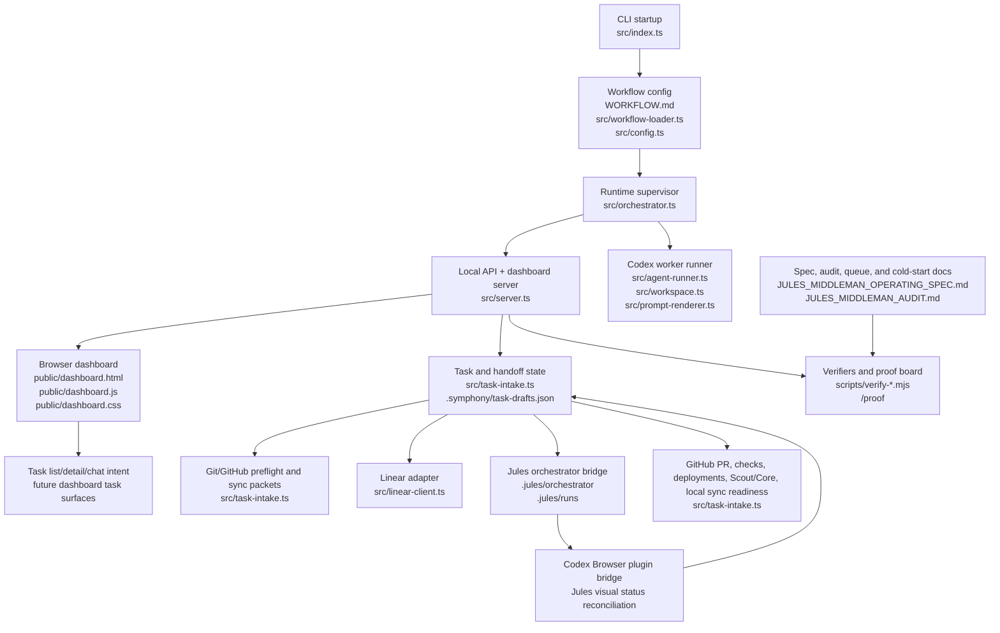

# Symphony/Jules Middleman Architecture

**Purpose**: map the files that make up Aralia's Symphony/Jules middleman system, so agents can understand ownership boundaries before editing code.

This file is the architectural index. It is not the behavioral spec and not the proof ledger:

- Use [`SYMPHONY_NORTH_STAR.md`](./SYMPHONY_NORTH_STAR.md) for the top-level objective, the proving-ground split, and the folder map.
- Use [`JULES_MIDDLEMAN_OPERATING_SPEC.md`](./JULES_MIDDLEMAN_OPERATING_SPEC.md) for required behavior, scenarios, blockers, and completion criteria.
- Use [`../JULES_MIDDLEMAN_AUDIT.md`](../JULES_MIDDLEMAN_AUDIT.md) for current implementation status, live proof, and remaining gaps.
- Use [`../README.md`](../README.md) for quick start and operator-facing entry points.

## Table Of Contents

- 1. [System Role](#system-role)
- 2. [Architecture At A Glance](#architecture-at-a-glance)
- 3. [Runtime Layers](#runtime-layers)
  - 3.1 [Startup And Configuration](#startup-and-configuration)
  - 3.2 [Orchestration And Worker Dispatch](#orchestration-and-worker-dispatch)
  - 3.3 [Local API And Dashboard Shell](#local-api-and-dashboard-shell)
  - 3.4 [Task Intake And Middleman State](#task-intake-and-middleman-state)
  - 3.5 [Git, GitHub, Scout/Core, And Local Sync Readiness](#git-github-scoutcore-and-local-sync-readiness)
  - 3.6 [Jules Bridge](#jules-bridge)
  - 3.7 [Verification And Proof](#verification-and-proof)
- 4. [File Ownership Map](#file-ownership-map)
- 5. [Main API Surfaces](#main-api-surfaces)
- 6. [Common Change Patterns](#common-change-patterns)
  - 6.1 [Adding A New Dashboard Control](#adding-a-new-dashboard-control)
  - 6.2 [Adding A New Readiness Packet](#adding-a-new-readiness-packet)
  - 6.3 [Adding Worker Behavior](#adding-worker-behavior)
- 7. [Verification Entry Points](#verification-entry-points)
- 8. [Current Gaps In This Map](#current-gaps-in-this-map)

## System Role

Symphony is the local dashboard-first middleman around the existing Aralia Jules workflow. It is responsible for safe task intake, Codex foreman clarification, Git/GitHub readiness, Linear tracking, Jules handoff staging and launch, Jules browser/session reconciliation, GitHub PR observation, GitHub Pages deployment observation, Scout/Core readiness, local sync readiness, Codex worker observability, and proof capture.

Symphony is not meant to replace Jules or become an unbounded local implementation runner. Codex workers launched by Symphony are foremen by default: they inspect dashboard state, clarify ambiguous tasks with the operator, prepare bounded handoffs, monitor external progress, explain blockers, and update the operator trail.

Approval gates are architectural boundaries, not a ban on local maintenance.
They protect external or workflow-advancing mutation: Linear, Jules, GitHub, PR
branches, deployment waivers, local master sync, and user-visible task
decisions. Local Symphony hygiene such as docs edits, verifier updates,
dashboard/API code edits, verifier runs, and local checkpoint commits stays
inside the implementation loop as long as it does not push, launch, merge, sync,
contact external systems, or claim that a live boundary advanced.

Documentation/proof synchronization is part of the architecture, not editorial
cleanup. The cold-start guide, operating spec, audit, open task queue,
proving-ground tracker, and decision ledger must stay aligned as real tasks
move through Symphony. When task execution reveals workflow friction, the local
foreman either patches the bounded doc/workflow issue or records the gap in the
owning live tracker before treating that proof slice as settled.

Artifact ownership is intentionally narrow. Symphony may produce rich local
receipts and runtime state so the dashboard can explain itself, but those
artifacts are not automatically Aralia GitHub history. Durable repo history
should contain task packets, prompts, acceptance criteria, package tracker
updates, final product PR links, focused workflow source/verifiers, and short
summaries of material blockers or accepted repairs. Raw receipts, generated
manifests, dashboard caches, click logs, local task-store churn, and
`.symphony`/`.jules` run output stay ignored or external unless a small excerpt
is deliberately promoted into an Aralia-facing doc.

## Architecture At A Glance



## Runtime Layers

### Startup And Configuration

Primary files:

- [`../src/index.ts`](../src/index.ts): CLI entry point. Parses workflow path, port, logs root, and `--dashboard-only`; starts the orchestrator and optional HTTP server.
- [`../WORKFLOW.md`](../WORKFLOW.md): real Aralia workflow configuration and prompt template.
- [`../WORKFLOW-mock.md`](../WORKFLOW-mock.md): mock tracker and mock Codex workflow for safe local verification.
- [`../src/workflow-loader.ts`](../src/workflow-loader.ts): loads Markdown front matter plus Liquid prompt template.
- [`../src/config.ts`](../src/config.ts): resolves typed config defaults and validates dispatch-time requirements.
- [`../src/types.ts`](../src/types.ts): shared domain types for issues, runtime state, workers, approvals, workflow config, and API-facing records.

Important boundary:

Startup should be safe for inspection. The dashboard and read-only APIs can start before worker dispatch is enabled. Dispatch-only dependencies such as tracker clients, workspace cleanup, and Codex app-server sessions are initialized lazily when the backend dispatch gate is enabled.

### Orchestration And Worker Dispatch

Primary files:

- [`../src/orchestrator.ts`](../src/orchestrator.ts): owns the poll loop, default-off dispatch state, candidate selection, worker assignment, retries, running-worker reconciliation, worker identity, Codex event retention, approval state, usage/rate-limit state, and `/api/v1/state` snapshot shape.
- [`../src/mock-client.ts`](../src/mock-client.ts): deterministic mock tracker used by safe verifier and smoke-test workflows.
- [`../src/linear-client.ts`](../src/linear-client.ts): Linear GraphQL adapter for real issue polling and status lookup.
- [`../src/workspace.ts`](../src/workspace.ts): per-issue workspace creation, cleanup, and workflow hooks.
- [`../src/agent-runner.ts`](../src/agent-runner.ts): Codex `app-server` subprocess client, thread/turn protocol handling, approval response bridge, and usage/rate-limit event capture.
- [`../src/prompt-renderer.ts`](../src/prompt-renderer.ts): renders the workflow prompt for each worker turn, including issue context, worker designation, and dashboard URL.

Important boundary:

`orchestrator.ts` is the only owner of live worker dispatch. The dashboard can request dispatch enable/disable through the API, but the backend decides whether ticks, retries, tracker polling, workspace cleanup, and worker launch may happen.

### Local API And Dashboard Shell

Primary files:

- [`../src/server.ts`](../src/server.ts): HTTP API, static dashboard server, proof board renderer, task-intake route wiring, dispatch-control route, approval route, and server-rendered fallback fragments.
- [`../public/dashboard.html`](../public/dashboard.html): static dashboard shell.
- [`../public/dashboard.js`](../public/dashboard.js): browser controller for state refresh, task intake, Git disposition, Jules handoff controls, PR/local-sync actions, usage panels, approvals, worker tables, activity feed, theme toggle, and dispatch toggle.
- [`../public/dashboard.css`](../public/dashboard.css): dashboard visual system and responsive layout.

Important boundary:

The dashboard is a control surface, not a second state owner. It renders backend state and posts explicit operator actions. It should not store orchestration truth in browser local storage except harmless display preferences such as theme.

The intended dashboard shape is task-centered. The home view should summarize open work and pending human-input counts, while each task should have a detail surface with timeline, current boundary, Linear/Jules/GitHub/deployment/local-sync links, expandable Jules prompt, expandable Codex/Jules dialogue, and a task-scoped Codex chat. These task surfaces should extend the existing task store and API rather than becoming a separate orchestration database.

### Task Intake And Middleman State

Primary files:

- [`../src/task-intake.ts`](../src/task-intake.ts): main middleman model. It owns task drafts, handoff records, Git preflight packets, Git disposition ledger, Linear issue previews, Jules manifest previews, handoff readiness, middleman path packets, Jules launch readiness, PR readiness, Scout/Core readiness, local sync readiness, task routing, task nudges, observed PR records, and proof-board data.
- [`../.symphony/task-drafts.json`](../.symphony/task-drafts.json): local durable store for dashboard drafts, handoffs, observed PRs, dispositions, and nudge records.
- [`../.symphony/live-proof/`](../.symphony/live-proof/): captured local/live proof artifacts when present.

Important boundary:

`task-intake.ts` is intentionally broad because it is the coordinator for many non-mutating readiness packets. New task/Jules/GitHub/local-sync state should usually extend this store before adding a parallel state file.

The Delegation ROI ledger belongs on the task/handoff record because it compares
the same task's measured Codex foreman spend, Jules/GitHub elapsed time, human
intervention count, local-edit avoidance, and estimated avoided local Codex
implementation. The baseline implementation derives `delegationRoiLedger` during
task-intake snapshot normalization, `server.ts` passes live Symphony
`codex_totals` into `/api/v1/task-drafts` when available, and
`public/dashboard.js` renders the ledger, the local task-scoped foreman-usage
form, and the local avoided-work estimate form. The `roi-foreman-usage` route
records measured Codex foreman usage that belongs to one handoff but was not
captured by Symphony worker totals; the `roi-estimate` route records only
Symphony-local estimate evidence. Neither route contacts Jules, GitHub, Linear,
or local Git. Broad `codex_goal_context` receipts are retained in a separate
goal-context usage bucket so the dashboard can show the cost of the larger
Symphony goal without treating that long-thread total as task-scoped ROI proof.
The ledger should continue to reuse orchestrator usage/rate-limit events and
task timeline data as those sources become available; estimates must be labeled
as estimates and must not be mixed into measured token totals.

The handoff timeline is also owned by `task-intake.ts`. It derives
`handoffTimeline` from stored facts on a handoff: draft creation, Linear issue
linking, manifest staging, Jules launch, plan approvals, operator messages,
Jules refreshes, GitHub PR refreshes, durable task nudges, repair decisions, ROI
ledger generation, and later local sync checks. `public/dashboard.js` renders
that packet as `Task timeline` on handoff cards. Nudge events are derived from
the task-nudge ledger, so the task page can explain why a timed refresh happened
without creating a second scheduler or conversation store. This is the first
task-centered dashboard slice; the full task detail page and task-scoped Codex
chat should build on the same task-store records instead of creating a parallel
conversation database.

The home-page `Task navigator` is intentionally presentation-only. It is built
inside `public/dashboard.js` from the same draft and handoff arrays already
returned by `/api/v1/task-drafts`, counts all/open/completed/archived records
plus tasks that need human input, filters those buckets as a browser display
preference, and links to the existing card that owns the detailed receipts. This
gives the operator a small task list without adding a new persistence layer. The
same section now renders a compact read-only `Task detail` preview for the first
visible navigator row. That preview links to `/tasks/:id`, the first standalone
task page, and to `GET /api/v1/tasks/:id`, the stable single-task read API. Both
surfaces derive one draft or handoff detail packet from the existing
task-intake snapshot, include current boundary, timeline, attached links,
human-blocker state, ROI/readiness records when present, and always return or
display non-mutation flags. The page is server-rendered by `HttpServer` so a
task can be opened directly without a second frontend application. It also
includes the read-only Jules handoff prompt, the read-only Jules
dialogue/approval history, stored `taskMessages`, `taskClarifications`, a local
message form, and a local clarification form. `POST /api/v1/tasks/:id/messages` appends a local
operator/Codex note to the same draft or handoff record; this is the first
task-chat storage baseline, not a Jules feedback route. `POST
/api/v1/tasks/:id/clarifications` records a structured Codex-foreman
clarification question and optional operator answer on the same local record.
The derived `clarificationState` marks whether that task is waiting for the
operator before Linear/Jules work should move onward. Neither route creates a
second task database, calls external services, or mutates Git. `POST
/api/v1/tasks/:id/disposition` uses the same
local task record to file work as active, completed, archived, or abandoned so
the dashboard can triage stale records without changing Linear, Jules, GitHub,
or local Git.

`server.ts` also derives `guardedActions` for handoff task details. These are
operator runbook entries for commands or endpoints that already exist elsewhere
in the handoff, such as PR refresh, marked Jules feedback, repair push, and
local sync. They are rendered on `/tasks/:id` as `Guarded Operator Actions`
because the operator needs to see what boundary is next, but the task page still
does not run GitHub comments, Git pushes, check reruns, merges, pulls, or Jules
messages automatically.

Human-blocker packets are derived in the same layer. `task-intake.ts` turns a
repair decision that needs the operator into an `operatorQuestion` packet with
plain-language question text, non-mutation flags, and the local
`operatorPreferences.quietHours` waiting policy. The default is weekday
01:00-09:00 Europe/Amsterdam, but the same store can persist operator overrides
for time zone, start/end hours, weekday-only behavior, or disabled quiet hours.
`server.ts` exposes `POST /api/v1/operator-preferences`, and
`public/dashboard.js` renders `Operator Preferences`; both are local dashboard
state and do not contact Jules, GitHub, Linear, local files, or Git. It also turns prepared
`repairPushReadiness` without a `repairPushResult` into a
`repair_push_approval` question, because approving a GitHub push is a different
decision from choosing a repair lane. That current-boundary question takes
precedence over the older repair-decision packet when both remain on the handoff
for audit history. `public/dashboard.js` renders both cases as `Needs your
input` plus a pending-human-input badge; for push approval it shows
approve/reject/wait choices and does not show the execute-repair-lane button.
The same store now records `operatorAnswers` as local-only receipts for the
selected repair lane or push decision. The first guarded repair action,
`create_setup_repair_task`, creates a local
setup-repair draft and `repairLaneExecutions` receipt only. This is not yet the
full task chat system or external repair-lane executor; it is the stable blocker,
answer, and local-draft record that chat and guarded external actions should
build on. Setup-repair drafts then become the routing focus when they are newer
than the source handoff, and the worker-mode packet recommends local-careful
Codex handling so workflow/setup failures are repaired locally before Jules is
given more implementation feedback.

The next boundary after a local repair commit is `repairPushReadiness`. It is
owned by the same task-intake store because it attaches to the handoff, but it
does not push. It records the worktree, branch, commit, repair-base commit,
current PR head commit, files, verification, PR, and push command while marking
the command as external mutation that still needs operator approval. The
repair-base/current-PR-head fields protect against pushing a stale local repair
after Jules or another actor has moved the PR branch. Its `postPushFollowUp`
packet then names the read-only sequence Symphony should observe after a human
push: GitHub checks rerun, PR refresh, and Scout/Core readiness update.
While no result receipt exists, this readiness packet is elevated into the
dashboard's plain-language operator question so the approval request is visible
in the task's human-input queue instead of hidden inside the readiness panel.
The handoff timeline labels that later answer as repair-push approval instead
of repair-lane choice, which keeps the chronological task view aligned with the
real boundary.
Once that approval answer is recorded, task routing switches to an
`operator_only` `Record repair push result` boundary. That state deliberately
shows the human-owned push command and the result endpoint while keeping worker
dispatch disabled, so Symphony does not loop on the old approval question and
does not imply that GitHub checks can rerun before the external push is
recorded.
After the human-owned push happens, the same handoff can store
`repairPushResult` as a local receipt. That receipt captures pushed/failed
status, pushed commit, resulting PR head, evidence URL, `gh pr checks` command,
refresh endpoint, and next boundary, but it still does not push, rerun checks,
merge, pull, or edit local files. The dashboard surfaces this as a
`Record Repair Push Result` control under the readiness packet so the operator
can turn an external GitHub action into durable Symphony evidence.

Documentation continuity is an architectural responsibility, not a cleanup
chore. The operating spec, audit, architecture overview, ordered open-task list,
and per-task handoff files are the shared memory that lets later Codex foremen
continue without re-litigating each boundary. Each implementation/proof stage
should update the status documents that own that stage before the stage is
treated as settled. Read-only observation slices should be recorded as
read-only, with the unchanged external boundary and the next operator-owned
mutation named explicitly, so the dashboard does not inherit invisible state
from a conversation thread.

### Git, GitHub, Scout/Core, And Local Sync Readiness

Primary owner:

- [`../src/task-intake.ts`](../src/task-intake.ts)

Related external surfaces:

- local Git commands used for preflight, disposition evidence, sync planning, and local sync readiness.
- GitHub CLI/API state used for PR checks, changed files, comments, artifacts, mergeability, and observed PR refresh.
- Scout/Core review concepts surfaced as readiness packets and action commands rather than direct autonomous mutation.

Important boundary:

Git preflight and local sync packets separate read-only inspection from human-run mutation. Symphony should expose mutating local sync only when the packet proves it is safe, and observed PRs should remain read-only learning/proof records. For changes that affect the published application, the GitHub Pages deployment boundary belongs between PR merge and local sync readiness.
That boundary now has a server-derived `deployment_readiness` packet. It is not
a deployment runner; it records whether the PR is merged, whether the handoff is
dashboard-started, which GitHub repository is involved, and which read-only
GitHub Pages/deployment-status commands should prove published-app health before
local sync proceeds. The local `deployment-evidence` route then records the
operator or foreman evidence as `deploymentEvidence` on the handoff. That receipt
is still Symphony-local and non-mutating; only `passed` or `waived` evidence can
unlock the local-sync readiness action.

Failed PR checks now have the same read-only-before-mutation rule. A PR refresh
may classify blockers and generate a repair decision packet, but the packet only
asks which lane to use: separate setup repair task, Jules feedback, workflow
configuration repair, manual wait, or refresh-after-repair. Posting feedback,
creating a tracking issue, editing workflow files, or changing local Git remains
operator-approved work outside the packet. A prepared local repair can be
recorded as `repairPushReadiness`, but GitHub push/rerun remains outside that
packet until the operator approves the external mutation. Freshness evidence on
that packet tells the operator whether the prepared repair still sits on the
current PR head or needs rebasing before any approval makes sense. Post-push
follow-up evidence keeps the next step read-only: watch checks, refresh the PR
packet, and only then reconsider Scout/Core readiness. A later
`repairPushResult` receipt records the outcome of the operator-owned push and
points Symphony at GitHub check observation; it is still Symphony-local evidence,
not a GitHub mutation path. The matching dashboard control records this receipt
only after the operator has already crossed the external push boundary.

### Jules Bridge

Primary owner:

- [`../src/task-intake.ts`](../src/task-intake.ts)

Related files/directories:

- [`../.jules/orchestrator/`](../.jules/orchestrator/): existing Aralia Jules orchestrator integration. Symphony should use this path instead of inventing another cloud-task launcher.
- [`../.jules/runs/`](../.jules/runs/): Jules run manifests and session records when present.

Important boundary:

Symphony prepares, stages, launches, refreshes, and records Jules handoffs. Jules owns cloud implementation. A dashboard-created task should pass through Git sync, Linear tracking, Jules manifest staging, Jules launch/session tracking, PR review, deployment observation when relevant, Scout/Core readiness, and local sync readiness.

The ARA-6 live run exposed a specific ownership boundary: local `.jules/runs` status can say `COMPLETED` with no PR URL while Jules API, browser-visible state, and GitHub each expose additional facts. Current browser evidence shows `Plan approved`, `All plan steps completed`, `View PR`, and failed check summaries; the Jules API exposes PR #931; GitHub confirms the matching PR. Symphony therefore needs a reconciliation layer that treats stored Jules status as one signal, not the only truth, prefers official Jules API outputs when available, uses the Codex app browser for visual confirmation when state is ambiguous, and falls back to read-only GitHub lookup by session id, branch name, handoff title, or Linear issue before declaring that no PR exists. Current Jules API docs describe that surface as alpha and expose sessions, activities, `approvePlan`, `sendMessage`, and PR outputs, so Symphony should keep API evidence versioned and avoid assuming the API shape is stable.

The reliable live browser route in Codex is the Browser plugin's in-app browser
bridge. A direct Playwright MCP call may fail with `Transport closed` even while
the in-app browser bridge can still list the signed-in Jules tab, read visible
state, and capture a screenshot. Terminal Playwright remains useful for
repeatable local dashboard verification, but Jules follow-along evidence should
prefer the in-app bridge because it is the operator-visible browser surface.
`server.ts` renders this rule on `/proof`, and `public/dashboard.js` renders the
same `Browser Follow-along` guidance inside the Jules Lifecycle group. `server.ts`
also exposes `GET /api/v1/browser-tooling-health`, a read-only packet that
names the Browser plugin bridge as the primary live follow-along path, records
direct Playwright `Transport closed` as a known unreliable path, lists
allowed/disallowed uses, carries the ARA-6 observed evidence, and keeps
external/local mutation flags false. This packet does not query Jules or become
a browser-state store; it is the operational contract future foremen should read
before deciding how to observe a live Jules session.

Jules repository environment setup is external configuration, not Symphony-owned state. Symphony should document recommended setup scripts and blockers, but running `Run and Snapshot` on the Jules Environment page is an operator-approved external action. The current ARA-6 evidence shows `npm ci` fails because the lockfile is out of sync, so `npm ci --no-audit --no-fund` is the desired future setup script only after lockfile repair; `npm install --no-audit --no-fund` is a diagnostic workaround that may dirty Jules' working copy. `server.ts` exposes this as the read-only `GET /api/v1/jules-environment-setup` packet and a `/proof` `Jules Environment Setup` card so future foremen can see the setup recommendation and external mutation boundary without relying on prior chat context.

### Verification And Proof

Primary files:

- [`../package.json`](../package.json): `verify:jules-contract` composes the main local contract suite.
- [`../scripts/verify-*.mjs`](../scripts/): focused contract tests for task intake, Git preflight, Linear/Jules previews, handoff readiness, middleman path, launch readiness, PR readiness, Scout/Core readiness, local sync readiness, dashboard rendering, worker identity, dispatch control, README/spec/audit text, and proof board behavior.
- [`../src/server.ts`](../src/server.ts): owns `/proof`, a compact server-rendered follow-along board for in-app browser proof.
- [`../public/dashboard.*`](../public/): rendered dashboard contract target for visual and DOM verifiers.

Important boundary:

The verifier suite is part of the architecture. New dashboard/API behavior should usually get a focused `scripts/verify-*.mjs` contract and, when it changes the overall mission, matching spec/audit assertions.

## File Ownership Map

| Area | Primary files | Owns | Should not own |
|---|---|---|---|
| CLI/runtime boot | `src/index.ts`, `WORKFLOW*.md` | process startup, port selection, workflow path, server lifetime | task state, dashboard rendering |
| Config parsing | `src/workflow-loader.ts`, `src/config.ts`, `src/types.ts` | typed workflow config and defaults | live dispatch decisions |
| Dispatch supervisor | `src/orchestrator.ts` | poll loop, dispatch gate, worker assignment, retry, running state, `/api/v1/state` | task draft/Jules handoff store |
| Tracker adapters | `src/linear-client.ts`, `src/mock-client.ts` | issue polling and state refresh | orchestration policy |
| Worker execution | `src/agent-runner.ts`, `src/workspace.ts`, `src/prompt-renderer.ts` | Codex app-server protocol, workspaces, prompts | dashboard task planning |
| Local API | `src/server.ts` | route handling, static dashboard assets, proof board, API response writing | durable task logic when `task-intake.ts` already owns it |
| Browser dashboard | `public/dashboard.html`, `public/dashboard.js`, `public/dashboard.css` | presentation and explicit operator actions | hidden orchestration state |
| Middleman store | `src/task-intake.ts`, `.symphony/task-drafts.json` | drafts, handoffs, readiness packets, nudges, observed PR records | live Codex process management |
| Jules bridge | `src/task-intake.ts`, `.jules/orchestrator`, `.jules/runs` | manifest preparation, launch readiness, session receipts, visual reconciliation inputs | replacing Jules implementation |
| Verification | `scripts/verify-*.mjs`, `package.json` | executable contracts and proof scaffolding | production behavior |
| Governance docs | `README.md`, `docs/JULES_MIDDLEMAN_OPERATING_SPEC.md`, `JULES_MIDDLEMAN_AUDIT.md`, this file | orientation, required behavior, status, architecture map | duplicating runtime state |

## Main API Surfaces

Human operators and foreman workers should prefer these local endpoints over guessing internal state:

- `GET /`: full browser dashboard.
- `GET /proof`: compact proof board for in-app browser follow-along.
- `GET /api/v1/state`: orchestrator snapshot, worker roster, dashboard URLs, dispatch state, usage, approval policy.
- `GET /api/v1/dispatch-control`: backend dispatch gate state.
- `GET /api/v1/browser-tooling-health`: read-only browser follow-along guidance packet; names the Codex Browser plugin bridge as primary, direct Playwright transport as known-unreliable, and records false mutation flags.
- `POST /api/v1/dispatch-control`: enable or pause new worker assignment.
- `GET /api/v1/task-drafts`: task queue, handoffs, Git preflight, routing, nudges, readiness packets.
- `GET /tasks/:id`: server-rendered task workspace for one draft or handoff, backed by the same detail packet, read-only Jules prompt/dialogue packets, and local task-message endpoint.
- `GET /api/v1/tasks/:id`: read-only detail packet for one draft or handoff, derived from `/api/v1/task-drafts` state with explicit non-mutation flags, Jules prompt history, Jules dialogue/approval history, local `clarificationState`, and local task disposition when present.
- `GET /api/v1/jules-handoffs/:id/deployment-readiness`: read-only deployment readiness packet for one handoff after merge and before local sync. It exposes GitHub Pages/latest-build and deployment-status inspection guidance plus safety flags, but it does not create deployments, rerun Actions, mutate GitHub, pull Git, or edit local files. Task detail packets link to this endpoint as `links.deploymentReadiness`.
- `POST /api/v1/tasks/:id/messages`: local operator-to-Codex task messages stored on the draft or handoff with explicit non-mutation flags; separate from Jules feedback.
- `POST /api/v1/tasks/:id/clarifications`: local structured Codex-foreman clarification question plus optional operator answer, stored on the draft or handoff with explicit non-mutation flags; separate from Jules feedback and Linear/Jules/GitHub actions.
- `POST /api/v1/tasks/:id/disposition`: local task filing receipt for active/completed/archived/abandoned task states with explicit non-mutation flags; separate from Linear/Jules/GitHub/Git actions.
- `POST /api/v1/task-drafts`: create a dashboard draft.
- `POST /api/v1/git-preflight`: refresh the hard Git/GitHub sync gate.
- `GET /api/v1/git-disposition/review`: read-only Git disposition packet.
- `POST /api/v1/git-disposition`: record operator Git disposition intent without mutating Git.
- `POST /api/v1/task-nudges`: record task routing/nudge evidence.
- `POST /api/v1/task-nudges/refresh-due`: run due external-read refresh nudges.
- `POST /api/v1/jules-handoffs/:id/roi-foreman-usage`: local measured task-scoped Codex foreman usage receipt for a handoff; separate from avoided-work estimates and external actions.
- `POST /api/v1/jules-handoffs/...`: stage, launch, refresh, message, approve, PR refresh, ROI estimate, deployment-evidence, local-sync, and observed-learning actions, each guarded by task-intake readiness.

Intended task-centered surfaces that are not yet fully represented as stable API contracts:

- `GET /api/v1/tasks/:id/terminal`: optional terminal-simulator stream for a local Codex foreman process or command output. This is a live view onto the task, not the task's source of truth; structured task messages and events remain canonical.
- live GitHub Pages adapter evidence beyond the current read-only deployment-readiness packet. The stable local contract exists; the remaining work is proving it against a real merged dashboard-started Jules PR and any future published-app targets.

## Common Change Patterns

### Adding A New Dashboard Control

1. Add or extend backend state in `orchestrator.ts` or `task-intake.ts`, depending on ownership.
2. Expose it through `server.ts`.
3. Render it in `public/dashboard.js` and style it in `public/dashboard.css`.
4. Add a focused verifier in `scripts/`.
5. Update the operating spec and audit if it changes the middleman contract.

### Adding A New Readiness Packet

1. Add the packet builder and snapshot field in `task-intake.ts`.
2. Expose links and mutation flags in the packet itself.
3. Render it in `public/dashboard.js` and `/proof` if it is part of follow-along proof.
4. Add a `verify-*-packet.mjs` contract.
5. Add scenario coverage to the operating spec and current status to the audit.

### Adding Worker Behavior

1. Decide whether it belongs to task routing/nudging, Jules handoff preparation, or live Codex dispatch.
2. For routing and handoff preparation, prefer `task-intake.ts`.
3. For live dispatch, use `orchestrator.ts`.
4. For prompt content, update `prompt-renderer.ts` and the workflow template.
5. Verify worker identity, model/reasoning assignment, prompt shape, and dashboard visibility.

## Verification Entry Points

Use these commands from `conductor/symphony/`:

```powershell
npm.cmd run build
npm.cmd run verify:jules-contract
```

For narrow dispatch/dashboard work, these are the most relevant targeted checks:

```powershell
node scripts\verify-dashboard-only-mode.mjs
node scripts\verify-dispatch-control-toggle.mjs
node scripts\verify-dashboard-foreman-console.mjs
node scripts\verify-dashboard-density.mjs
node scripts\verify-worker-mode-packet.mjs
```

For docs contract drift:

```powershell
node scripts\verify-readme-jules-middleman.mjs
node scripts\verify-operating-spec.mjs
node scripts\verify-middleman-audit.mjs
```

## Current Gaps In This Map

This file names the architecture as it exists now, but it should be kept compact. Detailed scenario status belongs in the audit, and detailed requirements belong in the operating spec.

Known places where future edits may need to update this map:

- if `task-intake.ts` is split into smaller modules;
- if Jules orchestration moves out of `.jules/orchestrator`;
- if GitHub access moves from CLI-driven snapshots to a dedicated adapter;
- if GitHub Pages deployment state becomes a first-class adapter instead of a GitHub CLI/API snapshot;
- if Scout/Core becomes an API integration instead of readiness commands;
- if the dashboard gains separate pages beyond `/` and `/proof`;
- if per-task chat/timeline state moves out of the current task-intake store;
- if Jules visual status reconciliation becomes automated instead of foreman/browser-driven;
- if the Browser plugin bridge gains a server-queryable live health signal
  beyond the current read-only `browser-tooling-health` operational contract.
