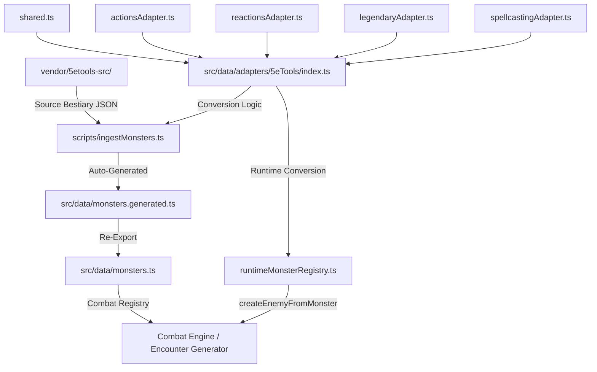

# Monster Data Pipeline & 5eTools Adapter

## Overview

Aralia uses a data-driven approach to populate its tactical combat bestiary. Instead of hand-writing every monster's stats and abilities, the project employs an automated ingestion pipeline that sources data from the **5eTools** bestiary JSON corpus.

This pipeline ensures that monster stats (AC, HP, Ability Scores), movement rules (2024 PHB Prone/Crawling), and action resolution (damage dice, targeting, ranges) are accurate to the source material while being adapted for Aralia's specific tactical grid engine.

---

## The Pipeline Flow



---

## Key Components

### 1. Ingestion Script (`scripts/ingestMonsters.ts`)
A build-time tool executed via `tsx` or `ts-node` that orchestrates the data flow.

**Key Operations:**
- **Bestiary Merging:** It concurrently reads the 2024 (XMM) and 2014 (MM) bestiary files. This is critical for the "2024 Modernization" goal, as the script ensures the best available stats are used.
- **Deduplication & Preference:** If a monster appears in both sources (e.g., "Wolf"), the script prioritizes the XMM version to capture the latest 2024 PHB balance changes.
- **Serialization:** After the Adapter transforms the JSON, the script serializes the objects into a TypeScript constant (`INGESTED_MONSTERS`) inside `monsters.generated.ts`.

### 2. The Adapter (`src/data/adapters/5eToolsAdapter.ts`)
The core transformation engine. It handles the mapping between 5eTools' idiosyncratic JSON schema and Aralia's clean runtime types.

#### Action Parsing Heuristics
Since 5eTools stores actions as unstructured text strings with embedded markup, the adapter uses a multi-stage regex pipeline to "discover" the mechanics of an ability:

1.  **Tag Detection:** Scans for `{@hit bonus}` to identify attack modifiers and `{@damage dice}` to identify primary damage expressions.
2.  **Type Promotion:** An action starts as a "utility" ability but is promoted to an "attack" if `{@atk mw}` (melee) or `{@atk rw}` (ranged) tags are found.
3.  **Range Conversion:** Text like `reach 5 ft.` or `range 80/320 ft.` is converted from feet to grid tiles (integer-based distance).
4.  **Area of Effect:** Scans for `cone`, `line`, or `radius` keywords to populate the `AreaOfEffect` object, enabling the engine to highlight multiple tiles in the UI.

#### Damage Mapping Logic
Aralia's damage model is currently simplified but uses capitalized identifiers for consistency with the `DamageType` enum. The adapter maps 5eTools' lowercase strings as follows:
- `fire` → `Fire`
- `cold` → `Cold` (corrected from legacy `ice`)
- `poison` → `Poison`
- `bludgeoning` / `piercing` / `slashing` → `Physical`

### 3. Monster Registry (`src/data/monsters.ts`)
This file acts as the public API for the bestiary. It re-exports the generated data while providing a **Manual Override Surface**. If a monster needs a custom balance tweak or an ability that the automated adapter can't yet parse, it can be defined here by spreading it over the generated entries.

---

## Tactical Mechanics Integration

### 2024 PHB Prone & Crawling
The pipeline automatically injects the **Stand Up** ability into every ingested creature.
- **Cost:** `Math.floor(speed / 2)` (Half movement).
- **Resolver:** The `useGridMovement.ts` hook detects the `Prone` condition and doubles the entry cost of every tile (the "Crawling" penalty). 
- **AI Knowledge:** The pathfinding algorithm (A*) is aware of this doubling, ensuring that prone monsters don't attempt to path further than their reduced movement allows.

### Defense Resolution
The adapter populates `resistances`, `vulnerabilities`, and `immunities` on the `MonsterData` object.
- **Case-Insensitive Resolution:** The `ResistanceCalculator` uses case-insensitive matching (`some` check) to ensure that `Poison` (mapped from 5eTools) correctly triggers against a `poison` damage type from an ability.
- **Immunity Priority:** Per 5e rules, the calculator processes Immunities first (damage becomes 0) before Halving (Resistance) or Doubling (Vulnerability).

---

## Technical Debt & Known Limitations

Developers should be aware of the following granular gaps in the current implementation:

### 1. Extraction Gaps (Adapter Logic)
*   **Trait Omission:** The `trait` array (passive abilities like *Pack Tactics*) is now parsed into `utility` Ability objects with `cost.type = 'free'` and `tags: ['passive']`. They surface in the combat UI for reference but are not player-activated. ✅ Resolved.
*   **Damage Effect `value` Missing:** `parseDamageEffects` was setting only `dice` on each `AbilityEffect`, leaving `value` as `undefined`. The combat AI's `evaluateAttackPlan` scored by `damageEffect.value || 0`, meaning every non-Multiattack attack scored 0 damage — the AI could not distinguish a Dragon's Rend from a Goblin's slash. `parseDamageEffects` now calls `diceAverage(dice)` (moved to `shared.ts`, now shared) and sets `value: Math.round(avg)` on every damage effect. `spellEffectMapper.ts` was updated identically for spell DAMAGE and HEALING effects. Rend: value=14, Fire Breath: value=28, Fireball: value=28, Tentacle: value=12. The AI now correctly prefers high-damage abilities. ✅ Resolved.
*   **Multi-Damage Truncation:** Action parsing now captures all `{@damage}` tags and assigns correct types based on proximity. ✅ Resolved.
*   **Save DC Extraction:** "DC X [Ability] save" text is not parsed into the `Ability.saveDC` field. ✅ Resolved.
*   **Save Ability Mapping:** The specific ability score required for a save (e.g., Dexterity vs. Wisdom) is not extracted. ✅ Resolved.
*   **Status Effect Extraction:** Conditions resulting from attacks (e.g., "target is Restrained") are now mapped to Aralia's `statusEffect` system via regex and tag scanning. ✅ Resolved.
*   **Recharge Mapping:** The `{@recharge N}` tag is stripped from text and converted into a functional `recharge` field with threshold and description, plus `isRecharging` flag. The `useTurnManager` hooks into `startTurnFor` to roll the d6 check each round and clear the flag on success. The `useAbilitySystem` sets `isRecharging: true` on ability execution. ✅ Resolved.
*   **Movement Type Narrowing:** Walk speed remains on `CharacterStats.speed` (feet). `fly`, `swim`, `climb`, and `burrow` are now stored on `CharacterStats.extraMovementSpeeds` when present in 5eTools data (see `src/data/adapters/5eToolsSpeed.ts`). The tactical grid still uses walk-only movement until aquatic/flight layers consume these fields. ✅ Resolved (data path).
*   **HP Formula Loss:** The HP dice formula (e.g., `2d8 + 4`) is now captured in `hpFormula` alongside `maxHP`. ✅ Resolved.
*   **Armor Source:** The source of AC is now extracted into `armorSource` (e.g. "Natural Armor") alongside the numeric `armorClass` value on `MonsterData`. ✅ Resolved.
*   **Spellcasting Conversion:** The `spellcasting` array is now parsed by `spellcastingAdapter.ts` into individual `Ability` objects. All three formats are handled: `will[]` (at-will, unlimited), `daily.{Ne}` (N/Day limits annotated on the ability name), and `spells.{}` (slot-based prepared spells; MM 2014 format). `saveDC` and `saveAbility` are extracted from `{@dc N}` markup in `headerEntries`. The `displayAs` field maps to `ActionCostType` (`action / bonus / reaction`). All spell abilities receive `type: 'spell'`, `isMagical: true`, and `tags: ['spell']`. ✅ Resolved.
*   **Action Block Exclusions:** `legendary` and `reaction` action arrays are now parsed by both the adapter and the ingest script. `parse5eToolsAction` accepts a `costType` parameter (`'action' | 'reaction' | 'legendary'`) so the cost tag is set correctly on each `Ability`; `'legendary'` was added to `ActionCostType`. Economy enforcement (per-round budget) remains a separate gap — see *Legendary Action Economy* below. `lair` actions are now resolved via a cross-file join: `ingestMonsters.ts` loads `legendarygroups.json`, builds a `Map<"Name:Source", group>` lookup, and after `convert5eToolsMonster` runs, checks `monster.legendaryGroup` to find the group. Because XMM groups often omit `lairActions` (retained only in MM), the lookup prefers whichever source carries `lairActions` — trying `"Name:Source"` first, then `"Name:MM"`, then `"Name:XMM"`. Lair action items are extracted from the `{type:"list", items:[...]}` entry, given synthetic names (first clause up to `,`, `(`, or `.`, max 6 words), and parsed via `parse5eToolsAction` with the new `costType: 'lair'`. `ActionCostType` was extended with `'lair'`; `CombatCharacterInspector` shows a "Lair" badge; `getAbilityIcon` returns `🏰`. Adult Red Dragon: 3 lair actions (Magma Geyser 6d6 fire/DC15 Dex, Tremor prone/DC15 Dex, Volcanic Gases poison/DC13 Con). Aboleth: 3 lair actions (Phantasmal Force cast, Tidal Pull prone/DC14 Str, Psychic Wave 2d6 psychic/DC14 Wis). ✅ Resolved (legendary + reaction + lair).
*   **`any` Types:** The adapter uses `any` for raw 5eTools input due to a lack of formal TypeScript definitions for the 5eTools schema.
*   **Attack Bonus Extraction & Description Cleanup:** `{@hit N}` markup (e.g. `{@hit 14}`) is now parsed by `actionsAdapter.ts` into `Ability.attackBonus`. `AbilityCommandFactory` uses this value directly when present, correcting accuracy for monsters with Wisdom-based or atypical attack bonuses. Additionally, `strip5eToolsMarkup` now explicitly suppresses attack-metadata tags (`{@atkr ...}`, `{@atk ...}`, `{@hit ...}`, `{@h}`) before the generic tag-stripping pass, then removes any leading punctuation artifacts (e.g., the `, ` left after `{@hit 14}` is stripped). Ability descriptions are now clean prose — "reach 10 ft. 13 (1d10 + 8) Slashing…" instead of "m 14, reach 10 ft. 13 (1d10 + 8)…". 21 abilities carry explicit `attackBonus` values. ✅ Resolved.
*   **Bonus Action Array (XMM):** The 2024 XMM format adds a top-level `bonus` array on monster objects for non-spellcasting bonus actions. `index.ts` now iterates `monsterData.bonus` and calls `parse5eToolsAction(entry, 'bonus')` for each entry. `parse5eToolsAction`'s `costType` parameter was widened to include `'bonus'`. Goblin Warrior's "Nimble Escape" is now correctly surfaced under the Bonus section of the inspect panel. 108 XMM monsters gain populated bonus actions. ✅ Resolved.
*   **Bonus Action Icon Indistinguishable from Passive Traits:** Bonus actions with no damage now use the `⚡` icon, reactions use `↩️`, and legendary actions use `🌟`, while passive traits continue to use `📖`. ✅ Resolved (actionsAdapter.ts).
*   **Icon Logic Duplication:** Icon assignment logic has been centralized into `getAbilityIcon` in `shared.ts`, used by both the action and trait adapters. ✅ Resolved.
*   **XMM Legendary Resistance as Passive:** Legendary Resistance and other usage-limited traits (e.g. "1/Day") now have their limits extracted from their names. The `Ability` type was extended with `maxUses` and `usesRemaining` fields to support mechanical tracking. ✅ Resolved.
*   **Spell Effects (Empty):** `spellcastingAdapter.ts` calls `mapSpellToAbilityProperties` (via `spellEffectMapper.ts`) when a `spellLookup` function is provided. The ingest script and runtime registry both pass the loaded spell registry. All 29 spell abilities in the current generated bestiary carry populated `effects[]`, correct `targeting`, and real grid `range` values. Fireball: `8d6` fire, area, range 30 tiles. Cone of Cold: `8d8` cold, area. Spells absent from the 459-spell registry still fall back to `effects: []` and `range: 6`. ✅ Resolved (for all spells in registry).
*   **Parenthetical Spell Names in `will[]`:** 5eTools sometimes encodes meta-notes inline with spell names in `will[]` entries (e.g. `"mage armor (included in AC)"`, `"fly (level 4 version)"`). The name was passed verbatim to slug/ID generation and registry lookup, producing garbled IDs like `mage_armor_included_in_ac__will_b0` and failing the spell registry match. `makeSpellAbility` now strips all parenthetical notes via `/\s*\([^)]*\)\s*/g` from both the display name and the slug before ID generation, and uses the clean name for registry lookup. Result: `mage_armor_will_b0` with correct name `"Mage Armor"`. ✅ Resolved.
*   **Legendary/Bonus Action Delegation (Effects Missing):** XMM legendary actions often delegate to an existing ability (e.g. `"makes one Rend attack"`, `"uses Spellcasting to cast Scorching Ray"`). These produced `effects: []` because no `{@damage}` tags were present, scoring them as 0 in the AI. A new `enrichLegendaryDelegations` post-processing step (in `index.ts`, runs after `enrichMultiattack`) detects two delegation patterns: (1) attack delegation via regex `makes?\s+(?:one|a)\s+([A-Za-z\s']+?)\s+attack` → copies referenced ability's effects/type/range/attackBonus; (2) spell delegation via `\bcast(?:s|ing)?\s+([A-Z][A-Za-z\s']+?)` → copies referenced spell ability's effects/targeting/range/saveDC. Results: Dragon's "Fiery Rays" → fire damage value=7 range=24; Dragon's "Pounce" → Rend slashing+fire effects range=2; Aboleth's "Lash" → Tentacle bludgeoning+Charmed range=3. ✅ Resolved.
*   **Spell Name Casing (Lowercase from 5eTools `{@spell}` Tags):** The 5eTools spell array format (`{@spell inflict wounds}`, `{@spell sacred flame}`) stores spell names in lowercase, which survived markup-stripping to produce ability names like `"inflict wounds"`. All spell names in `makeSpellAbility` are now title-cased via `.replace(/\b\w/g, c => c.toUpperCase())` after parenthetical stripping. "Inflict Wounds", "Sacred Flame", "Shield Of Faith" etc. now display correctly. ✅ Resolved.
*   **Multiattack Fallback Selecting Spells:** When `enrichMultiattack` found no named sub-attacks in the description, it fell back to the highest-average-damage ability — which could be a spell (e.g. Cult Fanatic's "Inflict Wounds" at avg 19 beats "Dagger" at avg 4). This produced wrong `subAttackIds` (`["inflict_wounds_l1_b0"]`) and wrong scaled effects. The fallback now restricts to `a.type === 'attack'` abilities only. Cult Fanatic Multiattack now correctly references Dagger with `value: 10` (2×1d4+2). ✅ Resolved.
*   **Slot Spell Description Overwrite Bug:** In `parseSpellcasting`, the slot path called `makeSpellAbility` (which correctly enriched the description from `spellData.description`), but then overwrote `ability.description` with `slotsNote + blockDescription` — discarding the enriched spell description and replacing it with the generic spellcasting block header. Fix: changed `ability.description = slotsNote + description` to `ability.description = slotsNote + ability.description`, so slot notes are prepended to the actual spell description. Cult Fanatic's Inflict Wounds now shows "A creature you touch makes a Constitution saving throw..." instead of "The fanatic is a 4th-level spellcaster...". ✅ Resolved.
*   **Healing Spell Targeting (`single_enemy` vs `single_ally`):** `mapSpellToAbilityProperties` mapped all `single`-targeting spells to `targeting: 'single_enemy'`, causing AI to try healing enemies. Now detects when all effects are `heal` type and no damage effects exist → sets `targeting: 'single_ally'`. Acolyte's Healing Word now correctly shows `targeting: "single_ally"`. Pure buff spells (e.g. Bless) that have only `status` effects are also now reclassified: `spellEffectMapper.ts` checks `spell.tags?.includes('buff')` and applies `targeting: 'single_ally'` when no damage is present. The fix also covers `multi`-targeting buff spells (Bless targets up to 3 creatures). The `STATUS_CONDITION` mapper was updated to use `'buff'` for known buff condition names (Blessed, Haste, etc.) via a `BUFF_CONDITIONS` set, instead of always defaulting to `'debuff'`. Acolyte's Bless now shows `targeting: "single_ally"`, `statusEffect.type: "buff"`. ✅ Resolved.
*   **Double DEX Initiative Bug + 2024 Initiative Support:** `baseInitiative` was set to `dexMod` in the adapter, but the combat engine already adds `dexModifier` from `character.stats.dexterity` in its roll formula (`d20 + dexMod + baseInitiative`). This caused MM 2014 monsters to roll initiative with double DEX modifier. Fixed: `baseInitiative` is now `0` for standard monsters (engine handles DEX), and `N × proficiencyBonus` for XMM 2024 monsters with `initiative: { proficiency: N }` — the 2024 rule where powerful creatures add their proficiency bonus multiple times to initiative. Adult Red Dragon: baseInitiative=12 (2×+6); Aboleth: baseInitiative=8 (2×+4); all others: 0. ✅ Resolved.
*   **Saving Throw Bonuses Not Extracted:** The 5eTools `save` field (e.g. `{dex: "+6", wis: "+7"}` for Adult Red Dragon) was silently discarded. The engine computed saves as `abilityMod + profBonus(level)`, but monsters use profBonus(CR) and may have Expertise-like double proficiency. Added `CharacterStats.saveBonuses?: Partial<Record<string, number>>` to `core.ts`. `savingThrowUtils.ts` now checks `target.stats.saveBonuses?.[abbrev]` first and uses it as the complete modifier (replacing computed abilityMod) when present. Monster adapter extracts `monsterData.save` into this map. Adult Red Dragon: dex+6, wis+7; Aboleth: dex+3, con+6, int+8, wis+6; Mage: int+6, wis+4. ✅ Resolved.

### 2. Resolution Gaps (Combat Engine)
*   **Physical Type Collapse:** *Bludgeoning*, *Piercing*, and *Slashing* are all collapsed into a single `Physical` type. ✅ Resolved.
*   **Magical Property:** The `isMagical?: boolean` flag is now set on `Ability` objects by the adapter — triggered by `{@atk ms}`, `{@atk rs}`, AoE-promoted spell type, or "this attack is magical" phrasing. Conditional nonmagical resistances/immunities (5eTools `cond: true` entries with "nonmagical" notes) are now parsed into `nonMagicalResistances`/`nonMagicalImmunities` on `MonsterData` and `CombatCharacter`. `ResistanceCalculator.applyResistances` accepts an optional `isMagical` flag and only applies those conditional defenses when `isMagical === false`. ✅ Resolved.
*   **Size Occupancy:** Monster `size` (Large, Huge) is now extracted into `CharacterStats.size`. The combat engine now supports multi-tile occupancy (2x2 for Large, 3x3 for Huge, etc.) for movement, targeting, and AI heuristics. Character tokens scale visually based on size category. ✅ Resolved.
*   **Duplicate Ability Keys:** `makeSpellAbility` now accepts a `blockIdx` parameter (0-based index from `parseSpellcasting`'s loop). The generated `id` becomes `${slug}_${idSuffix}_b${blockIdx}` — e.g. `fireball_will_b0` vs `fireball_will_b1`. This scopes IDs per-block so the same spell name in two different spellcasting blocks on a single monster produces distinct keys. Verified: zero within-monster ability ID collisions in the 14-monster bestiary. ✅ Resolved.
*   **Targeting Complexity:** Creature-type constraints on spells (e.g. `"Humanoid"` on Hold Person) are now propagated end-to-end. `mapSpellToAbilityProperties` reads `spell.targeting.filter.creatureTypes[]` and sets `Ability.validCreatureTypes` when non-empty (new optional field on the `Ability` interface). The AI (`combatAI.ts`) pre-filters enemy/ally target lists using `ability.validCreatureTypes` before passing them to `evaluateAttackPlan`/`evaluateSupportPlan` — a Mage will no longer try to Hold-Person a Zombie. `useTargetValidator.ts` blocks illegal targets with a clear message ("Hold Person can only target Humanoid creatures."). Sub-tag filtering for racial abilities (e.g. Goblinoid-only effects) follows the same path — add the sub-tag to `targeting.filter.creatureTypes` in the spell JSON. ✅ Resolved.
*   **Multiattack Range (Versatile Attacks):** `actionsAdapter.ts` now collects all `reach/range N ft.` values via `matchAll` and uses the maximum — so "reach 5 ft. or range 120 ft." yields `range: 24` instead of `range: 1`. Mage's Arcane Burst corrected. ✅ Resolved.
*   **"Within N Feet" Range Pattern Not Extracted:** Non-attack abilities using `"within N feet"` phrasing (e.g. Aboleth's "Consume Memories" at 30 ft, "Dominate Mind" at 30/60 ft, Giant Spider's "Web" at 60 ft) were getting `range: 1` because the range regex only matched `reach/range` keywords. A fallback was added for non-attack abilities using `matchAll` to collect all distance values. Refinement: abilities like Dominate Mind mention two distances — the targeting range ("within 30 feet") and a secondary control range ("within 60 feet") — so the MAX value was producing `range: 12` instead of `range: 6`. Non-attack abilities now use the **first** `within N feet` occurrence as targeting range (via `text.match` rather than `matchAll`), falling back to the max `reach/range` value if no `within` phrase exists. Attack abilities still use the max across all `reach/range` values (correct for "reach 5 ft. or range 120 ft."). Dominate Mind: range 6 (30ft), Consume Memories: range 6 (30ft), Giant Spider Web: range 12 (60ft). ✅ Resolved.
*   **Sense Enforcement:** Senses (Darkvision, Tremorsense) are extracted to stats and are now hooked into both the visibility system and the attack-roll advantage system. `WeaponAttackCommand` (`AbilityCommandFactory.ts`) enforces four condition-based rules: (1) Blinded attacker → Disadvantage; (2) Blinded target → Advantage; (3) Invisible target → Disadvantage; (4) Invisible/unseen attacker → Advantage. Additionally, on dark-ambient maps (cave/dungeon theme), the light level at the target's tile is computed via `VisibilitySystem.calculateLightLevels`. If the tile is in Darkness or Magical Darkness and the attacker's `stats.senses.darkvision` (or `blindsight`) in feet falls short of the attack distance, Disadvantage is applied — honouring the D&D 5e rule that you attack with Disadvantage when you can't see your target. ✅ Resolved.
*   **Multiattack Intelligence:** `convert5eToolsMonster` now runs a post-processing step (`enrichMultiattack`) after all action abilities are assembled. It parses the attack count from the description (word-numerals and digit-numeral patterns), resolves referenced sub-attack abilities by name-match, and synthesises combined N-hit damage effects (value = `diceAverage(subAttack) × count`, dice = scaled formula). The ability type is promoted from `utility` → `attack`, targeting from `self` → `single_enemy`, range is inherited from the best sub-attack, and `multiattackCount` / `subAttackIds` are populated. The AI's `evaluateAttackPlan` branch now picks up Multiattack as a viable scored action (Adult Red Dragon: first damage effect value=41 slashing + secondary 15 fire, Aboleth: value=24, Bandit: value=17). Full N-roll chaining (separate attack rolls per hit) is not yet implemented — the execution engine currently applies combined damage as a single hit. `Ability.multiattackCount` and `Ability.subAttackIds` are the hook points for a future execution enhancement. ✅ Resolved (data layer + AI scoring).
*   **Condition Immunities:** `CombatCharacter.conditionImmunities` is now populated from two sources at spawn time (`createEnemyFromMonster`): (1) type-inferred immunities via `CreatureTypeTraits` (e.g. Undead → Poisoned), and (2) explicit 5eTools `conditionImmune` array entries extracted by `parseConditionImmunities` in the adapter (e.g. Zombie: Exhaustion + Poisoned). Both sets are merged via `Set` to eliminate duplicates. `MonsterData` now carries `conditionImmunities?: string[]`. Both `StatusConditionCommand` and the zone-effect path in `useActionExecutor` check this field and skip application (with a log entry) when the target is immune. ✅ Resolved.

### 4. Refactor & Modularization Candidates

*   **Line of Sight for Multi-tile Creatures:** ✅ Resolved. The LoS check in `useTargetValidator.ts` now iterates through all occupied tiles of both the caster and the target (using `getOccupiedTiles`), granting LoS if any valid path is found. This supports correct 5e tactical positioning for Large and larger creatures.
*   **AreaEffectTracker Lifecycle:** `AreaEffectTracker` is now a hook-level singleton via `useRef<AreaEffectTracker>(new AreaEffectTracker([]))`. The ref is created once on hook mount. Before each use, `areaEffectTrackerRef.current.setZones(spellZones)` updates it to the current zone state. The inline `new AreaEffectTracker(spellZones)` per movement action has been removed. ✅ Resolved.
*   **AI Tactical Caching:** `evaluateCombatTurn` now passes two shared `Map` caches into `evaluateAoEPlan` for the full turn: (1) `turnAoECache` keyed by `"shape:size:cx,cy:castTileId"` — geometry-based rather than ability-id-based, so different spells with identical AoE footprints share tile computations; (2) `castPositionCache` keyed by `"range:cx,cy"` — abilities of the same range targeting the same center skip the `findCastPosition` path search. Both caches fall back to fresh local maps when `evaluateAoEPlan` is called standalone (e.g., in tests). ✅ Resolved.
*   **Visual Position Optimization:** Both style objects in `CharacterToken.tsx` (`style` container and `tokenStyle` circle) are now wrapped in `useMemo` with tight dependency arrays. `style` recalculates only when `position.x/y`, `multiplier`, or `targetingMode` change; `tokenStyle` recalculates only when `character.team`, `isSelected`, `isTargetable`, or `isTurn` change. The border-color conditional chain was inlined into `tokenStyle`'s memo. On a typical 10-token map, this eliminates ~20 style-object allocations per frame when only one token's state changes (e.g. turn advancing). ✅ Resolved.
*   **Action Executor Decomposition:** `useActionExecutor.ts` was growing towards 1,000 lines with a monolithic `executeAction` callback (~490 lines). It has been decomposed into three named inner `useCallback`s within the same hook: (1) `handleOpportunityAttacks(movedCharacter, previousPosition, targetPosition) → CombatCharacter` — isolated OA resolution with its own focused dep set (`characters`, `mapData`, `handleDamage`, `onLogEntry`, `onCharacterUpdate`, `addDamageNumber`); (2) `handleMoveExecution(character, action) → CombatCharacter` — full move sequence (position commit, tile effects, OA delegation, movement-debuff triggers, spell-zone entry/exit effects); (3) `handleAbilityEvents(action, updatedCharacter) → void` — post-update event emission and reactive trigger resolution. `executeAction` is now a lean coordinator (~80 lines) that validates, spends resources, and delegates. Its dep array shrank from 17 entries to 13. The public API (`{ executeAction }`) is unchanged; no callers required updates. ✅ Resolved.
*   **Legendary Action Economy:** `ActionEconomyState` and `CharacterStats` now include legendary action fields. `convert5eToolsMonster` extracts the budget (defaulting to 3 if legendary actions exist), and `createEnemyFromMonster` populates the runtime pool. `actionEconomyUtils` enforces consumption and handles turn-start resets. ✅ Resolved (Data & Tracking). Out-of-turn execution is now wired: `useTurnManager.endTurn` stores `executeAction` in a `useRef` (avoiding circular dependency), then after advancing the turn order checks all living enemy legendary monsters for remaining budget. For each, `evaluateCombatTurn` is called; if the AI's best action is a `legendary`-cost ability, `executeActionRef.current(plan)` fires it immediately and logs the action. Adult Red Dragon and Aboleth will now react to the end of each enemy/player turn. UI visualization — a dedicated Legendary Action indicator in the initiative tracker — remains a future enhancement but is not blocking. ✅ Resolved.
*   **Spell Runtime Tracking:** `useAbilitySystem` now decrements `usesRemaining` (floored at 0) after any ability execution where `maxUses !== undefined`. `AbilityPalette` gates the button disabled state with an `isExhausted` check. `AbilityButton` renders a `0/N` depletion overlay and shows "Uses: X/N" in the tooltip. `combatAI` skips abilities where `usesRemaining <= 0` (and also now correctly skips `isRecharging` abilities). Both player and AI execution paths share the same `abilitySystem.executeAbility` callback so enforcement is uniform. ✅ Resolved.
*   **Legacy Legendary Cost Encoding:** "Costs N Actions" name patterns (e.g., `"Wing Attack (Costs 2 Actions)"`) are now parsed centrally by `actionsAdapter.ts` into `AbilityCost.quantity`. The display name has the suffix stripped. This ensures correct cost representation for legacy MM 2014 monsters. ✅ Resolved.

### 3. Build Script Gaps

*   **Ingest Script Double Invocation:** Fixed — `scripts/ingestMonsters.ts` previously called `main()` twice at the bottom. ✅ Resolved.
*   **Script/Adapter Duplication:** Fixed — the ingest script now imports `convert5eToolsMonster` from `src/data/adapters/5eTools/index.ts` and delegates all conversion logic to it. The old hand-maintained copy has been removed. ✅ Resolved.
*   **Adapter Monolith:** The original `5eToolsAdapter.ts` (~650 lines) mixed shared utilities, action parsing, AoE detection, damage parsing, condition extraction, and orchestration into a single file. It has been split into a `src/data/adapters/5eTools/` submodule directory: `shared.ts` (utility functions), `actionsAdapter.ts` (core `parse5eToolsAction` logic), `reactionsAdapter.ts`, `legendaryAdapter.ts` (including "Costs N Actions" name parsing), and `index.ts` (orchestrator). `5eToolsAdapter.ts` is now a one-line re-export facade. ✅ Resolved.
*   **Legacy Legendary Cost Encoding:** "Costs N Actions" name patterns (e.g., `"Wing Attack (Costs 2 Actions)"`) are now parsed by `legendaryAdapter.ts` into `AbilityEffect.cost.quantity`. The display name has the suffix stripped. ✅ Resolved.

### 3. Encounter Simulator Gaps

*   **CR Field Variants:** `MonsterData.baseStats.cr` is always a plain string (e.g. `"17"`). The raw 5eTools JSON sometimes encodes CR as an object: `{ "cr": "13", "lair": "14" }` (MM) or `{ "cr": "17", "xpLair": 20000 }` (XMM). The adapter resolves this to the base CR string (`monsterData.cr?.cr || monsterData.cr`) but silently discards the lair-variant CR and XP. `crToXp()` in `encounterDifficulty.ts` therefore always uses the base CR even when computing a lair encounter's XP budget. ✅ Resolved (Added `crLair` and `xpLair` to `CharacterStats` and `PickedMonster`, and added an 'In Lair' toggle to the Encounter Modal UI).
*   **Party Levels Not Persisted on Encounter Modal:** The `partyUsed` prop (used to compute the CR budget bar) is only populated when the encounter modal is opened via the AI oracle flow. When opened via Dev Menu's "Generate Encounter" button, `partyUsed` is undefined and the difficulty bar is suppressed even though `customMonsters` may be non-empty. The party levels are available in `GameState` and should be read directly inside the modal as a fallback. ✅ Resolved.
*   **No Spell Lookup at Encounter Build Time:** `useSpellRegistry` now correctly fetches `spells_manifest.json` using `import.meta.env.BASE_URL` (the Vite base is `/Aralia/` — the hook was fetching `/data/spells_manifest.json` instead of `/Aralia/data/spells_manifest.json`). Individual spell JSON paths are corrected the same way. `spellcastingAdapter.makeSpellAbility` now uses `spellData.description` (and appends `higherLevels` when present) instead of the generic spellcasting block header. Fireball on the Adult Red Dragon now shows "A bright streak flashes from you to a point you choose within range…" with full damage/range/targeting in the combat inspect panel. ✅ Resolved.

---

## Maintenance & Extension

### Regenerating the Bestiary
Whenever the 5eTools vendor source is updated, or the adapter logic changes, run:
```powershell
npx ts-node scripts/ingestMonsters.ts
```

### Adding New Priority Monsters
The `TARGET_MONSTERS` array in the ingestion script defines which creatures are included in the final bundle. To expand the game's monster pool, simply add the name to that list and re-run the script.

### Debugging the Adapter
If an action description looks malformed or a damage type is missing, check the `parse5eToolsAction` function in `5eToolsAdapter.ts`. It uses a heuristic-based detection system that may need new regex patterns for complex multi-damage or multi-effect actions.

---

## Known Gotchas

- **MM 2014 vs XMM 2024 schema divergence**: Same fields use different structures. CR: plain string vs `{ cr, lair }` (MM) vs `{ cr, xpLair }` (XMM). AC: object array with `from[]` (MM) vs plain number array (XMM). Spellcasting: `spells{}` with slot counts (MM) vs `will[]` / `daily{}` only (XMM). `bonus` action array: XMM-only — MM has no equivalent.
- **`strip5eToolsMarkup` handles all tag forms**: `{@spell Fireball|XPHB}` → `"Fireball"`, `{@condition Prone}` → `"Prone"`, `{@dc 20}` → `"DC 20"`, `{@action Disengage|XPHB}` → `"Disengage"`, `{@actSave con}` → `"Constitution saving throw"`, `{@actSaveFail}` → `"On a failed save,"`. Always pass raw 5eTools text through this before display.
- **`any` types on adapter input are intentional**: 5eTools has no published TypeScript definitions. Do not attempt to type the raw input — format variants will break narrow types.
- **Registry pre-seed vs runtime registration**: `runtimeMonsterRegistry` is pre-seeded from `MONSTERS_DATA` (the ingested subset) on startup. MonsterPicker registers additional monsters on click via `registerMonster`. Both paths call `convert5eToolsMonster`.
- **Dynamic `.ts` imports from `preview_eval` do not work** in this Vite setup. Verify runtime behavior by grepping `monsters.generated.ts` for the ingested path, or by inspecting the combat UI after Simulate Battle.
- **`SeededRandom.nextInt(min, max)` is MAX-EXCLUSIVE**: use `nextInt(0, arr.length)` not `nextInt(0, arr.length - 1)`. For d20: `nextInt(1, 21)`.
- **`useSpellRegistry` requires `import.meta.env.BASE_URL` prefix** — the Vite app is served at `/Aralia/`, so `public/data/` is served at `/Aralia/data/`, not `/data/`. Any `fetch('/data/...')` call will 404. Always prefix with `import.meta.env.BASE_URL` when fetching from `public/`. The manifest path was the only broken fetch; individual spell paths in `entry.path` also needed the base prepended.
- **`usesRemaining` in the generated file may look missing** — the JSON field appears after the `tags` array, so a grep for `"Legendary Resistance"` + `maxUses` will seem to miss it unless you read the full ability block. Always search for `maxUses` separately or read the whole entry.
- **`combatAI` did not check `isRecharging`** until this was fixed — only `currentCooldown > 0` was guarded. Both flags must be checked to prevent the AI from attempting to use an ability mid-recharge-cooldown.
- **`bonus` array and `spellcasting displayAs:'bonus'` can coexist on the same monster** (e.g. Cloaker, Vampire): the `bonus` array contains non-spell tactical bonus actions; `spellcasting` with `displayAs:'bonus'` contains spell-type bonus actions. These are distinct abilities — the adapter correctly produces both. Do not deduplicate them.
- **Nested entry objects in traits/actions**: Some 5eTools monster entries use nested objects instead of flat strings — e.g. `{type: "list", items: [{type: "item", name: "Forbiddance", entries: [...]}]}`. The naive `entries.join(' ')` call produced `[object Object]` in descriptions. All entry parsing in `actionsAdapter.ts` and `index.ts` now routes through `extractEntryText(entries)` in `shared.ts`, which handles `list`, `item`, `entries`, `inset`, and `table` node types recursively.
- **Attack metadata tags should NOT appear in descriptions**: `{@atkr m}`, `{@atk mw}`, `{@hit 14}`, `{@h}` are stripped to empty in `strip5eToolsMarkup` (before the generic tag-stripping pass) to prevent artifacts like "m 14, reach 10 ft." in display text. Leading punctuation from removed tags is also trimmed. A secondary pass strips leading `"to hit,"` — the literal phrase left behind after `{@hit N}` removal (e.g. `"{@hit 4} to hit, reach 5 ft."` → `"reach 5 ft."`).
- **Save markup requires special handling**: `{@actSave dex}` → "Dexterity saving throw", `{@dc 21}` → "DC 21", `{@actSaveFail}` → "On a failed save,", `{@actSaveSuccess}` → "On a success,", `{@actSaveSuccessOrFail}` → "Regardless of the save,". These conversions happen in `strip5eToolsMarkup` before the generic pass, producing readable descriptions like "Dexterity saving throw DC 21, each creature in a 60-foot Cone…".
- **XMM wraps AoE keywords in `{@variantrule}` tags**: "60-foot cone" (MM) becomes "60-foot `{@variantrule Cone [Area of Effect]|XPHB|Cone}`" in XMM. `parseAreaOfEffect` was only matching bare keywords — the regex now also matches the `{@variantrule Cone`, `{@variantrule Line`, and `{@variantrule Sphere` patterns. Adult Red Dragon's Fire Breath (60-foot cone) now correctly produces `type: "spell"`, `targeting: "area"`, `range: 12`, enabling the AI's `evaluateAoEPlan` branch.
- **Versatile attack range (reach X or range Y)**: For abilities with both reach and range values (e.g. Mage's Arcane Burst: "reach 5 ft. or range 120 ft."), the original regex took the first match — always `reach 5` → 1 tile. `actionsAdapter.ts` now collects all `reach/range N` values via `matchAll` and uses the maximum, giving Arcane Burst `range: 24` (120ft/5) so the Mage AI correctly stands off and doesn't charge into melee.

<!-- aralia-backlog-walked: {"source":"docs/tasks/backlog-retirement/RETIREMENT_LEDGER.md","path":"docs/architecture/MONSTER_DATA_PIPELINE.md","sha256WithoutMarker":"afe45b81ea9e0ad3ea27c9e3f77308515f87aefecbe5477d48c85240612ef440","markedAtUtc":"2026-06-26T00:12:35.437Z"} -->
