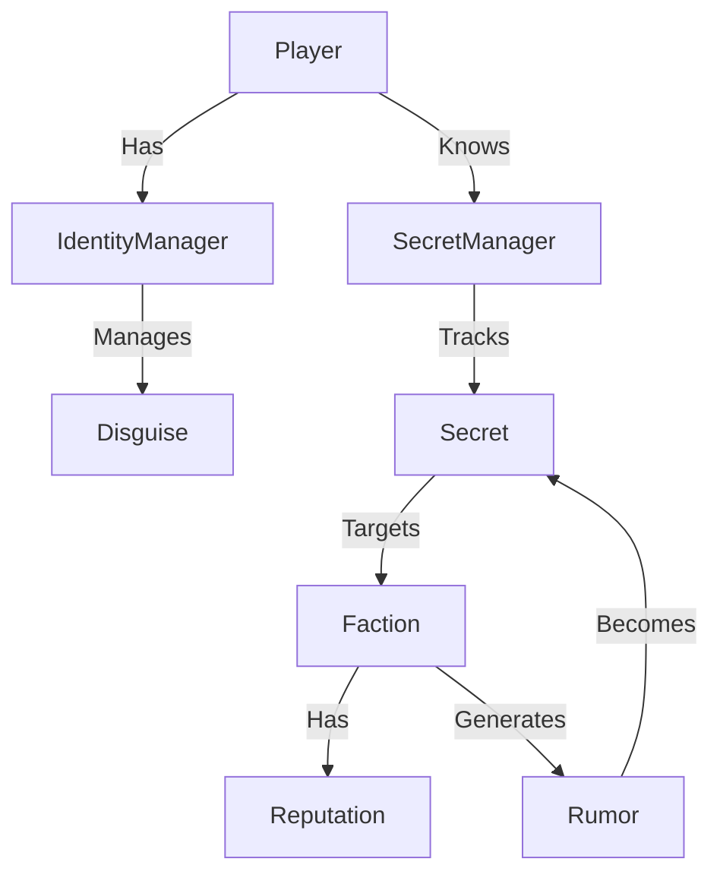

# Intrigue Domain Architecture

## Core Concepts

### 1. Factions
The primary actors in the political landscape. Factions have:
- **Power**: Overall strength (0-100).
- **Assets**: Tangible resources (territory, personnel).
- **Relationships**: Public and secret standings with other factions.
- **Secrets**: Information that, if revealed, causes damage.

### 2. Secrets & Leverage
Information is currency.
- **Secrets** have value (1-10) and verification status (Rumor vs. Verified).
- **Leverage** is the application of a secret to force an outcome (blackmail).

### 3. Rumors
Low-confidence information that spreads through the world.
- Can be upgraded to Verified Secrets via investigation.
- Can be planted (Disinformation) to damage reputation.

### 4. Identity
Who the world thinks the player is.
- **Public Identity**: The default persona.
- **Disguises**: Alternative personas with their own reputation tracks.

## System Map

## Implementation Plan

1. **Secret System**: Standardize `Secret` type and storage.
2. **Rumor Mill**: Event-based rumor generation from Faction actions.
3. **Blackmail Mechanic**: Ability to trade Secrets for Favor/Gold.
4. **Disguise System**: Skill-based identity masking.
