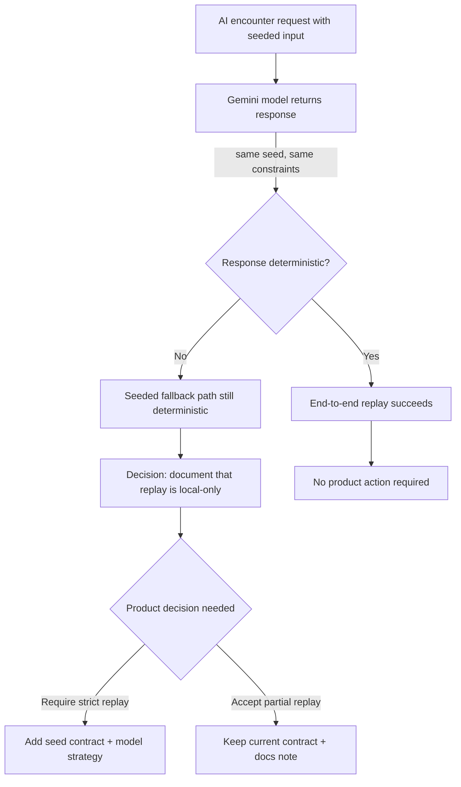

# Encounter Generator Gap Registry

Status: review-required
Last updated: 2026-06-09

Use this file for durable unresolved findings that belong directly to encounter generation in this project.

## Gap Log

| Gap ID | Status | Classification | Owner | Owning tracker | Found during | Gap | Evidence | Why it matters | Next action | Next proof/check |
|---|---|---|---|---|---|---|---|---|---|---|
| G4 | blocked_human_decision | in_scope_now | Worker B | `TRACKER.md` | Seed iteration | Strict end-to-end deterministic AI encounter generation is not guaranteed because provider output can vary despite fixed prompt/seed | `src/services/gemini/encounters.ts`, `src/services/geminiServiceFallback.ts`, `src/hooks/actions/handleEncounter.ts` | Replay workflows can still diverge whenever Gemini returns a different valid encounter for the same seed and same constraints | Product decision required: define if full end-to-end replay guarantees are needed before advancing to cross-session encounter sharing | Review task update required; capture decision in tracker next iteration |

## Classification Reference

- `in_scope_now`: Must be resolved for current feature completion.
- `support_needed_now`: Needed to progress safely but not core to MVP implementation.
- `adjacent_follow_up`: Related and useful, but not required in current pass.
- `out_of_scope`: Explicitly excluded.
- `blocked_human_decision`: Requires owner/product decision.
- `blocked_external_state`: Waiting on external dependency.

## Required Review Brief

### G4: AI Determinism Boundary

| Option | Decision path | Consequence |
|---|---|---|
| A | Require full deterministic AI output | Add explicit Gemini replay contract, stronger cache/binding, and CI proof before T3+ feature expansion |
| B | Accept nondeterministic AI output, seeded only for local/fallback paths | Keep deterministic replay guarantee bounded to bestiary + fallback; add docs warning in NORTH_STAR and TRACKER |

Current choice required from product to continue wider rollout where reproducibility is contractual.

## Update Rules

- Keep each gap tied to evidence and a next proof/check.
- Link back to a global gap ID when this project imports one.
- If the current project should not own a gap, add or update the global gap tracker instead of keeping the gap here.
- Do not mark a gap done unless completion evidence is linked or summarized.
- Add dated testimony or status notes to an existing gap instead of opening duplicates.
