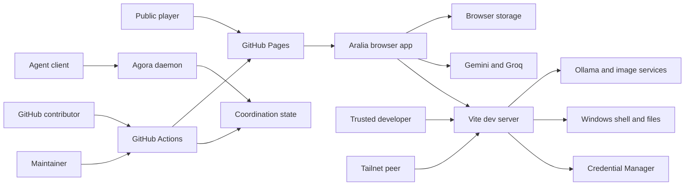

# Aralia threat model

Verified: 2026-08-12

## Executive summary

Aralia's public product is a static, single-user browser game, so it has no production API, shared database, or server-side authorization boundary. The highest risks instead sit where the browser holds player-owned AI credentials and where the local Vite development process crosses into the Windows host. The current development configuration binds Vite and unauthenticated WebSocket terminal services beyond loopback and exposes arbitrary command execution through REST and PTY endpoints. The operator reports that development is local with possible Tailscale or Parsec access. On that basis, workstation command execution is **high** priority and becomes **critical** if an untrusted tailnet peer, routed network, or hostile browser origin can reach those ports. Browser credential theft and unauthenticated use of the server-held Groq credential are also high-priority themes.

## Scope and assumptions

- **In scope:** the complete `F:\Repos\Aralia` repository, including the public React/Vite game, browser persistence, Gemini/Groq/Ollama integrations, Vite development plugins, Agora coordination daemon, and GitHub Actions deployment and AI workflows.
- **Evidence snapshot:** commit `80c66932ac73faa54ece9e9515246880cc9976c3` on `master`, plus the shared checkout's uncommitted working-tree state inspected on 2026-08-12. Current behavior should be rechecked after overlapping work lands.
- **Deployment:** the player-facing build is a public static GitHub Pages site. It has no application backend, shared account system, or server-side game database (`README.md`; `.github/workflows/deploy.yml`).
- **Development exposure:** `npm run dev` is intended for a trusted local workstation. It may be used through Tailscale or Parsec. Parsec is treated as authorized remote console access. Tailscale is treated as a conditional network boundary whose risk depends on tailnet ACLs, host firewall rules, subnet routing, and peer trust.
- **Data sensitivity:** player-owned API keys, OAuth access tokens, AI interaction logs, and saved game history are treated as sensitive. They are not assumed to be regulated data.
- **Attacker baseline:** a public web attacker may control game input and content submitted through GitHub issues or pull requests. A tailnet peer may send packets only if ACLs and the Windows firewall allow them. The attacker does not already control the Windows account, browser extensions, repository maintainership, or a trusted GitHub identity.
- **Out of scope:** the internals of Google, Groq, Ollama, GitHub, Tailscale, and Parsec; the Agent Matrix control plane in `F:\Repos\Aralia-operator-dashboard`; physical access; and post-compromise behavior after the Windows account or GitHub maintainer account is already controlled.

Open questions that materially affect ranking:

- Do Tailscale ACLs and Windows firewall rules prevent every untrusted peer from reaching Vite port 3000, Agora port 4319, and the random PTY WebSocket ports?
- Is Google OAuth enabled in any public deployment, and must it request the broad `cloud-platform` scope rather than a narrower Gemini-specific scope?
- Are developer/operator pages expected to remain available from the ordinary `npm run dev` server, or can privileged plugins move to a separate loopback-only mode?

## System model

### Primary components

- **Public static site:** GitHub Actions builds React and TypeScript with Vite and deploys `dist` to GitHub Pages. The production host serves static HTML, JavaScript, styles, and game data (`.github/workflows/deploy.yml`; `vite.config.ts`).
- **Browser game:** React executes game rules and UI behavior locally. It renders authored and generated content and sends narrative requests to the selected AI provider (`index.tsx`; `src/App.tsx`; `src/services/`).
- **Browser persistence:** save payloads live in IndexedDB with localStorage fallback; save metadata and player-selected AI credentials use Web Storage (`src/services/saveLoadService.ts`; `src/services/indexedDBStorageService.ts`; `src/services/ai/aiCredentials.ts`; `src/services/ai/aiProviderSettings.ts`).
- **Cloud AI providers:** the browser can call Gemini or Groq directly using a player-owned API key or Google OAuth bearer token. Google Identity Services supplies the OAuth token (`src/services/ai/googleOAuth.ts`; `src/services/ai/oauthGeminiClient.ts`; `src/services/ai/groqTextProvider.ts`).
- **Local model path:** browser requests use the same-origin `/api/ollama` route, which the Vite server proxies to local Ollama (`src/config/llmProviderConfig.ts`; `vite.config.ts`).
- **Vite developer control plane:** the ordinary dev server loads plugins that expose filesystem, process-launch, shell, PTY, agent-session, proxy, and dashboard routes. Vite binds to `0.0.0.0` (`vite.config.ts`; `scripts/vite-plugins/ptyTerminalManager.ts`; `scripts/vite-plugins/agentSessionManager.ts`).
- **Groq credential proxy:** Vite can read a Groq key from Windows Credential Manager and inject it into upstream requests. A standalone proxy binds to loopback (`scripts/vite-plugins/groqProxyManager.ts`; `tools/groq-proxy/proxy.mjs`).
- **Agora daemon:** a local HTTP coordination service stores agents, tasks, locks, and messages. Mutating identity-sensitive operations use bearer tokens, while registration and several read surfaces are public (`tools/agora/server.mjs`; `tools/agora/store.mjs`).
- **GitHub automation:** Actions build, test, deploy, and run Gemini/Jules-assisted review or triage workflows with repository or app tokens (`.github/workflows/`).

### Data flows and trust boundaries

- **Internet user -> GitHub Pages:** static assets and public game data cross HTTPS. There is no app authentication, server session, request validation, or application rate limiting because Pages is a static host. GitHub supplies transport security.
- **Browser input -> React/game logic:** names, choices, dialogue, and AI prompts cross in-memory component boundaries. React escapes ordinary text. Selected HTML renderers use DOMPurify, and some prompt paths truncate or neutralize markers (`src/components/Glossary/GlossaryContentRenderer.tsx`; `src/utils/core/securityUtils.ts`). Validation is not proven uniform across every input path.
- **Browser -> IndexedDB/Web Storage:** saves, logs, preferences, API keys, and OAuth tokens cross browser storage APIs. Same-origin policy is the main confidentiality control. Data is plaintext to any script executing in the Aralia origin and to a user or extension with browser-profile access.
- **Browser -> Gemini/Groq:** prompts and game context cross HTTPS with an API key or OAuth bearer token. Provider authentication and TLS protect transport. Aralia validates several structured Gemini responses with Zod, but validation is response-type-specific (`src/services/gemini/encounters.ts`; `src/services/geminiSchemas.ts`).
- **Browser -> Vite dev server:** game, dashboard, API, and process-control requests cross HTTP and WebSocket. The server binds to all interfaces. Most privileged PTY and agent-session routes have no authentication or origin validation (`vite.config.ts`; `scripts/vite-plugins/ptyTerminalManager.ts`; `scripts/vite-plugins/agentSessionManager.ts`).
- **Vite -> Windows host:** developer endpoints cross from HTTP/WS data into `cmd.exe`, `node-pty`, child processes, filesystem access, inherited environment variables, and Windows Credential Manager. This is the repository's strongest privilege transition.
- **Vite -> Groq:** keyless browser requests cross Vite middleware, which injects a Credential Manager key and forwards data over HTTPS. Process startup has loopback and same-origin checks, but the inference mount itself does not apply those checks (`scripts/vite-plugins/groqProxyManager.ts`, especially `isLoopbackRequest`, `isSameOriginRequest`, and the middleware after `MOUNT`).
- **Agent client -> Agora:** bearer tokens authenticate agent-specific mutations. The daemon's default `server.listen(port)` does not bind explicitly to loopback, so network isolation depends on the host firewall and routing (`tools/agora/server.mjs`).
- **Repository events -> GitHub Actions:** pull requests, issues, comments, commits, and workflow results cross into Actions. Workflow permissions and trigger conditions are the main authorization controls; third-party action code and AI prompts execute inside that trust boundary (`.github/workflows/ci.yml`; `.github/workflows/gemini-dispatch.yml`; `.github/workflows/ci-fix.yml`).

#### Diagram

## Assets and security objectives

| Asset | Why it matters | Security objective (C/I/A) |
|---|---|---|
| Windows account, shell, and filesystem | PTY processes inherit the developer's working directory and environment and can modify source or access user data | C/I/A |
| Player Gemini and Groq API keys | Theft permits quota consumption and provider activity under the player's account | C/I |
| Google OAuth access token | The default scope includes `cloud-platform`; theft may have impact beyond one Gemini request, subject to the user's Google permissions | C/I |
| Credential Manager Groq key | This is deliberately kept out of the browser but becomes usable through the Vite proxy | C/I |
| Saved game, AI logs, and player-authored content | Disclosure harms privacy; tampering destroys progression and trust in save recovery | C/I/A |
| Repository and public Pages artifact | Compromise can ship malicious JavaScript to every player and create a credential-stealing origin | I/A |
| GitHub app/action tokens and AI service secrets | Theft or misuse can alter repository state, comments, workflows, or deployments within granted scopes | C/I |
| Agora tasks, locks, identities, and messages | Integrity is required to prevent conflicting edits and false work attribution in the shared checkout | I/A |
| AI request budget and local compute | Unbounded or unauthorized requests can consume paid quota, GPU/CPU, memory, and developer time | A |

## Attacker model

### Capabilities

- Visit the public Pages application and control normal game inputs in their own browser.
- Host a malicious website and attempt cross-origin HTTP or WebSocket access to services on the victim's localhost, LAN address, or tailnet address, subject to browser and network controls.
- If admitted to the same tailnet and allowed by ACL/firewall policy, probe ports exposed by services bound to all interfaces.
- Submit pull requests, open issues, or provide other untrusted text to workflows that accept public repository events.
- Tamper with their own IndexedDB/localStorage and construct syntactically valid save payloads.
- Influence AI prompts through player-authored text and attempt to make model output violate the expected game-data contract.

### Non-capabilities

- A web attacker cannot directly read another origin's browser storage without script execution in the Aralia origin, a browser/extension compromise, or a browser vulnerability.
- The public Pages deployment has no production shell, application database, account store, or server-side save API to attack.
- A tailnet peer is not assumed able to reach the host unless Tailscale ACLs, routing, and Windows firewall rules permit it.
- Parsec access is assumed to be intentionally granted to a trusted operator. A stolen Parsec account is an external account-compromise scenario, not a new Aralia network entry point.
- Public contributors do not have maintainer permissions or direct access to repository secrets. Workflow trigger and permission checks still need to enforce this assumption.

## Entry points and attack surfaces

| Surface | How reached | Trust boundary | Notes | Evidence (repo path / symbol) |
|---|---|---|---|---|
| Public React application | HTTPS GitHub Pages URL | Internet -> browser origin | Static, unauthenticated client application | `.github/workflows/deploy.yml`; `index.tsx` |
| Character names, dialogue, choices, AI prompts | Game UI | User input -> game and AI logic | Some length, character, and marker controls exist; coverage is path-dependent | `src/utils/core/securityUtils.ts`; `src/services/ollama/conversation.ts` |
| Authored/generated HTML and SVG | React rendering surfaces | Data -> DOM | Glossary/Markdown paths use DOMPurify; other SVG sinks require source-specific review | `src/components/Glossary/GlossaryContentRenderer.tsx`; `src/components/DesignPreview/steps/PreviewMdLibrary.tsx` |
| AI credential settings | Player settings UI | User secret -> Web Storage | Gemini key and OAuth token use localStorage; Groq can use local, session, or proxy mode | `src/services/ai/aiCredentials.ts`; `src/services/ai/aiProviderSettings.ts` |
| Google OAuth token flow | Google Identity Services | Google account -> browser origin | Default scope includes `cloud-platform`; token is persisted in localStorage | `src/services/ai/googleOAuth.ts`; `src/config/env.ts` |
| Gemini/Groq generation | Browser `fetch` | Browser -> cloud provider | Bearer/key authentication over HTTPS; prompts may contain game/player data | `src/services/ai/oauthGeminiClient.ts`; `src/services/ai/groqTextProvider.ts` |
| Save load and persistence | IndexedDB/localStorage | Browser origin -> persistent state | Adjacent non-cryptographic checksum detects accidental corruption, not malicious changes | `src/services/saveLoadService.ts`; `src/utils/core/hashUtils.ts` |
| Vite server | Port 3000 by default | Local/LAN/tailnet -> Node process | Configured with `host: '0.0.0.0'` and the full plugin set in ordinary main mode | `vite.config.ts`, `server.host`, `mainPlugins` |
| Sticky PTY WebSockets | Random WS ports plus port-discovery APIs | Network client -> Windows shell | No token, origin check, or client authorization; shell inherits `process.env` | `scripts/vite-plugins/ptyTerminalManager.ts`, `ptyTerminalManager`, `shellTerminalManager` |
| Agent session spawn and WS | `/api/agent-sessions*` and random WS port | HTTP/WS request -> arbitrary command | Caller supplies `cmd`, `cwd`, and environment additions; responses allow any origin | `scripts/vite-plugins/agentSessionManager.ts`, `spawnSession` |
| Same-origin Groq proxy | `/__groq/v1/*` | HTTP request -> Credential Manager-backed cloud call | Process-start route is restricted; inference requests are not authenticated or loopback-gated | `scripts/vite-plugins/groqProxyManager.ts`, `MOUNT`, `configureServer` |
| Standalone Groq proxy | `127.0.0.1:8787` | Local HTTP -> cloud provider | Loopback binding is good; CORS reflects any requesting origin | `tools/groq-proxy/proxy.mjs`, `cors`, `server.listen` |
| Agora HTTP API | Port 4319 | Local/LAN/tailnet -> coordination state | Agent mutations use bearer tokens; listener does not specify loopback | `tools/agora/server.mjs`, `bearerToken`, `listen` |
| GitHub Actions and AI automation | PR, issue, comment, push, workflow result | Contributor/repository -> CI identity | Mix of SHA-pinned and tag-pinned actions; AI consumes untrusted repository text | `.github/workflows/` |

## Top abuse paths

1. **Execute commands through agent sessions:** an allowed tailnet peer reaches Vite port 3000 -> calls `POST /api/agent-sessions/spawn` with an arbitrary `cmd` and optional `cwd` -> Vite launches `cmd.exe /c` with the developer's environment -> attacker reads output over the unauthenticated WebSocket or causes blind filesystem/repository changes -> Windows account and source integrity are compromised.
2. **Take over the sticky shell:** an attacker reaches `/api/pty/port` or `/api/shell-terminal/port` -> learns the random WebSocket port because the discovery route allows every origin -> connects without a token or origin check -> sends terminal input -> receives buffered output and controls a shell in the repository directory.
3. **Consume the server-held Groq credential:** a peer reaches `/__groq/v1/chat/completions` -> sends a keyless request -> Vite reads the Groq credential from Windows Credential Manager and forwards the request -> attacker consumes quota and sends arbitrary data under the operator's provider account without learning the key itself.
4. **Steal browser-held provider credentials:** malicious script executes in the Aralia origin through a future XSS, compromised dependency/artifact, or trusted script compromise -> reads `aralia.ai.credentials` and Groq Web Storage keys -> exfiltrates API keys or the broad Google OAuth token -> attacker consumes quota or invokes APIs allowed by the token until expiry/revocation.
5. **Drive game-state corruption through an AI response:** attacker-controlled text reaches a model prompt -> model returns adversarial, oversized, or structurally unexpected content -> a consumer without the stronger Zod checks accepts it -> game state, narrative integrity, rendering availability, or provider budget is affected. There is no server or OS tool privilege in the production AI path, which caps impact.
6. **Poison AI-assisted repository automation:** contributor-controlled issue, PR, or workflow context contains instructions aimed at the Gemini/Jules agent -> automation interprets content as operator intent and uses its granted GitHub capabilities -> misleading comments, unwanted issue/branch activity, or a harmful proposed change is produced -> maintainer trust and repository integrity are degraded.
7. **Disrupt shared coordination:** a peer reaches Agora -> registers an agent and obtains its own bearer token -> creates noise, messages, tasks, or locks within the permissions granted to ordinary agents -> real workers are misdirected or blocked. Existing per-agent tokens prevent straightforward impersonation of an already registered agent but do not establish operator-approved admission.
8. **Forge a local save:** a user or same-origin script changes the saved state -> recomputes the public `simpleHash` value stored beside it -> load accepts the checksum -> progression or gameplay facts are forged. Current impact is limited to that browser's single-player state.

## Threat model table

| Threat ID | Threat source | Prerequisites | Threat action | Impact | Impacted assets | Existing controls (evidence) | Gaps | Recommended mitigations | Detection ideas | Likelihood | Impact severity | Priority |
|---|---|---|---|---|---|---|---|---|---|---|---|---|
| TM-001 | Malicious website, LAN peer, or tailnet peer | A privileged dev server or its random WS ports are reachable. For tailnet attack, ACL/firewall policy must permit the connection. | Use unauthenticated PTY input or `POST /api/agent-sessions/spawn` to execute arbitrary commands as the developer. | Workstation and repository compromise; credential and file theft; destructive commands. | Windows shell/files, source, environment credentials, availability | Intended local use; random WS port; session-count cap. `ptyTerminalManager.ts` and `agentSessionManager.ts` show no authentication. | Vite binds all interfaces; WS servers do not bind loopback; arbitrary `cmd`, `cwd`, and inherited environment; CORS `*`; no Origin check. | Remove PTY/agent-session plugins from ordinary main mode. Bind Vite and every WS server to `127.0.0.1` by default. Require a high-entropy per-start token on REST and WS upgrade, validate Origin/Host, reject caller-supplied `cwd`/environment unless allowlisted, and use a separate privileged operator profile. Add restrictive Tailscale ACL and Windows Firewall rules. | Log every denied and accepted privileged request with remote address and route; alert on non-loopback clients, new PTY sessions, or unexpected child processes; inspect firewall/Tailscale flow logs. | Medium under stated local/trusted use; high if reachable by untrusted tailnet peers | High | **high**, conditional **critical** |
| TM-002 | Script executing in the Aralia origin | A future XSS, compromised dependency/build artifact, or trusted remote script executes in the app origin while credentials exist. | Read localStorage/sessionStorage and exfiltrate Gemini/Groq keys or OAuth access tokens. | Provider quota theft; exposure of AI activity; possible Google Cloud actions within token permissions. | Player API keys, OAuth token, AI quota, privacy | React escaping; DOMPurify on glossary/Markdown HTML; token expiry skew; OAuth token is short-lived (`GlossaryContentRenderer.tsx`; `aiCredentials.ts`). | API key and OAuth token are plaintext in localStorage; default OAuth scope is broad; CSP permits `'unsafe-inline'` and `'unsafe-eval'`; public CSP also permits localhost connections. | Keep OAuth tokens in memory or sessionStorage, never persistent localStorage. Default API keys to session-only and make persistence an explicit warning. Replace `cloud-platform` with the narrowest usable scope. Split production and development CSPs; remove `unsafe-eval`, migrate inline script to a hashed/nonced file, remove localhost from production `connect-src`, and add Trusted Types where practical. | Add CSP reporting, provider quota/billing alerts, token revocation UI, and a visible last-used/expiry indicator. Never log raw credentials. | Medium | High | **high** |
| TM-003 | Network peer or hostile local origin | Vite's `/__groq/v1/*` is reachable while a Groq credential is present. | Submit keyless requests that Vite authenticates with the Credential Manager key. | Paid quota consumption, provider abuse attributed to operator, and unintended external transmission of attacker data. | Groq credential authority, quota, reputation, availability | Key stays in Credential Manager and is never returned; `/__groq/start` enforces loopback, same origin, JSON, and bounded port (`groqProxyManager.ts`). Standalone proxy binds `127.0.0.1` (`proxy.mjs`). | The inference mount and health route do not apply the start route's loopback/origin checks or any token/rate/body limit. Standalone proxy reflects arbitrary Origin. | Apply loopback and authenticated-session checks to every proxy route, not only process start. Use a per-start CSRF/bearer token, strict Origin/Host allowlist, request/body/concurrency limits, model allowlist, and rate budget. Return minimal health data. Use `Access-Control-Allow-Origin` only for the exact local UI origin. | Log request count, model, status, byte size, and remote address without prompts or keys; alert on non-loopback access and provider quota spikes. | Medium | High | **high** |
| TM-004 | Player, same-origin script, or browser-profile attacker | Ability to modify browser storage. | Forge or corrupt saves and recompute the adjacent non-cryptographic checksum. | Loss or fabrication of local progression; load-time resource consumption from oversized state. | Save integrity and availability | Malformed JSON handling, version check, transient-state resets, bounded discovery log, IndexedDB isolation (`saveLoadService.ts`). | `simpleHash` is not an authenticity control; loaded state is not uniformly schema-validated; no explicit serialized-size limit was identified. | Document the checksum as corruption detection only. Add versioned Zod validation and size/count/depth limits before migration/hydration. If cross-user sharing or cloud saves arrive, authenticate server-side or sign with a server-held key; do not invent a client-side secret. | Record local validation failures and show a recoverable quarantine/export path rather than silently loading. | High for self-tampering, low for cross-user attack | Low | **low** |
| TM-005 | Malicious player text or model/provider response | Input reaches an AI prompt and a response path accepts content with incomplete validation. | Inject instructions, produce oversized responses, or exploit weak assumptions in structured-response consumers. | Corrupted narrative/game state, UI failure, quota/compute exhaustion. | Game integrity, saves, provider budget, local compute | Input truncation/marker neutralization; Zod validation for encounter, custom action, and social outcome responses (`securityUtils.ts`; `ollama/conversation.ts`; `gemini/encounters.ts`). | Controls are heuristic and not proven on every prompt/response path; prompt injection cannot be solved by string replacement alone. | Inventory all model response types and require schema validation, maximum sizes, timeouts, and bounded retries at the provider boundary. Treat model text as data, never authority. Keep AI unable to invoke OS, filesystem, or GitHub tools from the production game. | Track validation rejection rates, timeouts, response sizes, and per-session token use without storing secrets. | Medium | Medium | **medium** |
| TM-006 | Cloud provider, compromised provider account, or unintended prompt construction | Player selects a cloud AI provider and gameplay context contains private material. | Send more saved-game, dialogue, or identity context than the player expects; retain it in local logs or provider history. | Privacy disclosure and loss of player trust. | Saves, AI logs, player-authored content | Cloud fallback is opt-in and credentials are player-owned; local Ollama is the default (`.env.example`; `aiCredentials.ts`; `aiProviderSettings.ts`). | No complete data-flow inventory or user-facing per-provider disclosure was established; OAuth email is stored with credentials. | Show a concise disclosure of fields sent before cloud enablement. Minimize prompt context, make AI-log retention controllable, redact credentials and unnecessary identifiers, and provide clear local-data deletion/export controls. | Add privacy-preserving telemetry only with consent; surface provider, model, and last request time locally. | Medium | Medium | **medium** |
| TM-007 | Public contributor or compromised third-party Action tag | A workflow consumes attacker-controlled repository text or resolves a mutable action tag. | Prompt-inject AI automation or execute compromised action code inside granted GitHub permissions. | Unauthorized comments/issues/branch changes, secret exposure, or malicious Pages artifact depending on job permissions. | Repository, Pages artifact, GitHub/app tokens, AI keys | CI uses read-only contents permission; dispatch gates command comments to trusted associations; several actions are SHA-pinned; deploy permissions are job-scoped (`ci.yml`; `gemini-dispatch.yml`; `deploy.yml`). | Some actions use major/version tags such as `actions/checkout@v6`, `actions/setup-node@v6`, and `google-labs-code/jules-invoke@v1`; AI consumes untrusted issue/PR context; CI-fix activation relies on external Jules behavior. | Pin every third-party action to a reviewed commit SHA. Treat PR/issue text as untrusted data in agent prompts. Separate analysis from write-capable jobs, require maintainer approval for mutations, minimize app-token scopes, protect the Pages environment, and prevent untrusted workflow results from selecting a write target. | Enable GitHub audit/secret-scanning alerts, review app-token events, retain workflow provenance, and alert on unexpected workflow or Pages changes. | Low to medium | High | **medium** |
| TM-008 | Misconfiguration or malicious repository change | A `VITE_*` secret is supplied during a public build or secret resolution is broadened. | Embed a provider key into static JavaScript and publish it to GitHub Pages. | Immediate public secret disclosure and quota abuse. | Deployment secrets, provider quota, public artifact integrity | Deploy intentionally passes no Gemini key; Vite comments prohibit defining a key into the bundle (`deploy.yml`; `vite.config.ts`). | `src/config/env.ts` still treats `VITE_GEMINI_API_KEY` and `VITE_IMAGE_API_KEY` as browser-readable configuration by design; future operators may mistake the prefix for secrecy. | Add a build-time secret-pattern gate over `dist`, fail public builds if sensitive `VITE_*` values are set, and reserve Vite variables for public configuration. If shared production AI is required, use a separately authenticated server-side broker. | Scan artifacts before upload and monitor provider keys for unexpected public use. | Low | High | **medium** |
| TM-009 | Unapproved local or tailnet participant | Agora port 4319 is reachable and admission remains open. | Register a new agent, obtain ordinary credentials, then create coordination noise or consume locks/tasks/messages available to that role. | Conflicting edits, false attribution, denial of coordination, and lost developer time. | Agora identity/task/lock/message integrity | Agent-specific bearer tokens protect identity-sensitive mutations; public views redact tokens (`tools/agora/server.mjs`; `tools/agora/store.mjs`). | Listener does not specify loopback; registration is an admission path, not operator authorization; service relies on environmental network isolation. | Bind loopback by default. For remote coordination, put Agora behind authenticated Tailscale identity or an admission token, distinguish operator-approved enrollment from self-registration, enforce quotas, and keep public responses minimal. | Alert on non-loopback registration, rapid agent/task creation, lock storms, and repeated 401s; retain a redacted audit trail. | Low to medium | Medium | **medium** |

## Criticality calibration

- **Critical:** likely or practical compromise of the developer workstation, repository deployment authority, or high-value cloud authority without prior trusted access.
  - An internet or untrusted-tailnet request reaches the unauthenticated PTY and executes commands as the Windows user.
  - A CI path exposes GitHub app credentials and publishes a malicious Pages artifact to all users.
  - A stolen broad OAuth token is shown to authorize material Google Cloud actions beyond Gemini quota use.
- **High:** serious credential, host, or paid-service impact with a meaningful prerequisite or constrained exposure.
  - A reachable dev server permits shell execution, but current Tailscale ACLs restrict reachability to trusted peers.
  - An Aralia-origin script steals a player API key or short-lived OAuth token.
  - A peer abuses the Credential Manager-backed Groq proxy without obtaining the raw key.
- **Medium:** material integrity, privacy, or availability impact without workstation takeover or durable cross-user compromise.
  - Prompt injection corrupts a local game or consumes bounded AI quota.
  - AI-assisted GitHub automation posts or proposes misleading changes that still require maintainer review.
  - An unapproved Agora identity disrupts coordination but cannot impersonate an existing token holder.
- **Low:** local, recoverable impact requiring control of the same browser profile or the user's own data.
  - A player forges their own single-player save.
  - Malformed local state causes a recoverable load failure.
  - Low-sensitivity dev metadata is disclosed without a path to credentials or command execution.

## Focus paths for security review

| Path | Why it matters | Related Threat IDs |
|---|---|---|
| `vite.config.ts` | Selects privileged plugins for ordinary dev mode, binds the server to all interfaces, and defines local proxy boundaries | TM-001, TM-003, TM-008 |
| `scripts/vite-plugins/ptyTerminalManager.ts` | Exposes unauthenticated shell WebSockets and cross-origin port discovery | TM-001 |
| `scripts/vite-plugins/agentSessionManager.ts` | Accepts arbitrary commands, working directories, and environment additions over unauthenticated HTTP/WS | TM-001 |
| `scripts/vite-plugins/groqProxyManager.ts` | Crosses from keyless HTTP requests to a Credential Manager-backed cloud credential | TM-003 |
| `tools/groq-proxy/proxy.mjs` | Implements the standalone secret-bearing loopback proxy and permissive CORS policy | TM-003 |
| `src/services/ai/aiCredentials.ts` | Persists Gemini API keys and OAuth access tokens in localStorage | TM-002, TM-006 |
| `src/services/ai/aiProviderSettings.ts` | Controls Groq key persistence and user-supplied proxy URLs | TM-002, TM-003 |
| `src/services/ai/googleOAuth.ts` | Loads Google Identity Services and stores the resulting bearer token | TM-002 |
| `src/config/env.ts` | Defines browser-visible Vite secrets and the default broad Google OAuth scope | TM-002, TM-008 |
| `index.html` | Defines the production CSP, including unsafe script modes and localhost connectivity | TM-002 |
| `src/components/Glossary/GlossaryContentRenderer.tsx` | A major `dangerouslySetInnerHTML` boundary whose DOMPurify policy should remain regression-tested | TM-002, TM-005 |
| `src/services/saveLoadService.ts` | Hydrates integrity-critical state from attacker-modifiable browser storage | TM-004 |
| `src/services/gemini/` and `src/services/ollama/` | Contain prompt construction, response parsing, schema use, limits, and log behavior | TM-005, TM-006 |
| `tools/agora/server.mjs` and `tools/agora/store.mjs` | Define network binding, admission, bearer authorization, and coordination-state visibility | TM-009 |
| `.github/workflows/` | Defines third-party action provenance, AI prompt boundaries, token permissions, and public deployment authority | TM-007, TM-008 |

## Notes on use

- This is an architecture-level threat model, not proof that every abuse path has been exploited. TM-001 and TM-003 are grounded in reachable code paths, but live reachability from a tailnet peer was not tested.
- The immediate decision is whether privileged developer tooling belongs in ordinary main dev mode. Moving it to an explicit loopback-only operator mode removes several high-risk paths at once.
- Tailscale does not make an unauthenticated service authenticated. Tailnet identity and ACLs can be strong compensating controls only when the host is not broadly shared, ACLs are explicit, subnet routing is understood, and the Windows firewall matches the intended policy.
- Parsec should be protected as a privileged remote-console account with strong authentication and device/session controls. Once a remote user is intentionally controlling the Windows desktop, Aralia's localhost binding is no longer the primary authorization boundary.
- Quality check:
  - Covered the public UI, browser storage, cloud AI, local AI/proxies, privileged Vite APIs, Agora, and GitHub automation entry points discovered in the review.
  - Represented every identified trust boundary in at least one threat or explicitly explained why it has low impact.
  - Kept production runtime, local development/operator tooling, and CI/build behavior separate.
  - Incorporated the operator's clarification that development is local with possible Tailscale/Parsec access.
  - Recorded assumptions and the exposure questions that could change priority.
