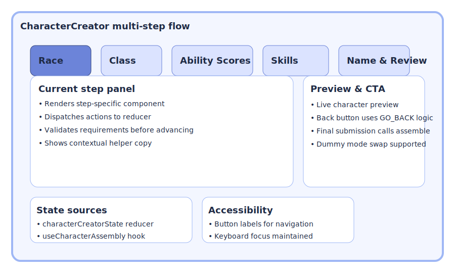

# CharacterCreator Component

## Purpose

The `CharacterCreator.tsx` component is the central orchestrator for the multi-step character creation process in the Aralia RPG. It guides the user through selecting their character's race, class, ability scores, skills, class-specific features, race-specific choices, and finally naming and reviewing their character.

It now manages its state using a `useReducer` hook with logic extracted into **`src/components/CharacterCreator/state/characterCreatorState.ts`**. The complex logic for validating and assembling the final `PlayerCharacter` object, as well as generating character previews, is encapsulated in the **`useCharacterAssembly` custom hook** (from `src/components/CharacterCreator/hooks/useCharacterAssembly.ts`).

The final `PlayerCharacter` object includes all pre-calculated derived stats (like `darkvisionRange`, final `speed`, `maxHp`, `armorClass`) and fully aggregated spell lists, serving as the single source of truth for these values.

## Visual Reference

## Structure

The character creation process is divided into several steps, managed by the `CreationStep` enum (now in `characterCreatorState.ts`). The UI for each distinct selection part of a step is handled by dedicated sub-components.

`CharacterCreator.tsx` itself is responsible for:
1.  Maintaining the overall state of the character being built via `useReducer` (using elements from `characterCreatorState.ts`).
2.  Controlling the current `CreationStep`.
3.  Rendering the appropriate step-specific UI component.
4.  Passing data and callback functions (dispatching actions) to child components.
5.  Handling navigation logic (`goBack` dispatches an action handled by the reducer).
6.  Orchestrating the final character assembly and preview generation using the `useCharacterAssembly` hook.
7.  **Animations**: Uses the `framer-motion` library with `AnimatePresence` to create smooth, sliding transitions between each step of the character creation process, enhancing the user experience.

The main steps include:
1.  **Race Selection**
2.  **Age Selection**
3.  **Background Selection**
4.  **Visuals Selection**
5.  **Class Selection**
6.  **Ability Score Allocation**
7.  **Human Skill Choice (Conditional)**
8.  **Skills Selection**
9.  **Class Features Selection (Conditional)**
10. **Weapon Mastery Selection (Conditional)**
11. **Feat Selection (Conditional)**
12. **Name and Review**

*(Note: Race-Specific Selections have been deprecated as a distinct top-level step and moved to inline variant selections within the Race Detail Pane).*

## Props

*   **`onCharacterCreate: (character: PlayerCharacter, startingInventory: Item[]) => void`**:
    *   **Type**: Function
    *   **Purpose**: Callback invoked upon completion, receiving the fully assembled `PlayerCharacter` object and their starting inventory.
    *   **Required**: Yes
*   **`onExitToMainMenu: () => void`**:
    *   **Type**: Function
    *   **Purpose**: Callback invoked when the "Back to Main Menu" button is clicked.
    *   **Required**: Yes
*   **`dispatch: React.Dispatch<AppAction>`**:
    *   **Type**: Function
    *   **Purpose**: Dispatch function for the global application state, passed down for global actions during creation.
    *   **Required**: Yes

## State Management (`useReducer`)

*   State logic (reducer, initial state, action types, enums) is now in **`src/components/CharacterCreator/state/characterCreatorState.ts`**.
*   `CharacterCreator.tsx` uses `useReducer` with these imported elements.

## Core Functionality

*   **Step Navigation**: Handler functions dispatch actions. The reducer (in `characterCreatorState.ts`) handles step transitions, including `GO_BACK` logic using `stepDefinitions`.
*   **Data Calculation & Assembly (via `useCharacterAssembly` hook)**:
    *   The `useCharacterAssembly` hook provides:
        *   `assembleAndSubmitCharacter(currentState, name)`: Called by `handleNameAndReviewSubmit` to validate, assemble, and call `onCharacterCreate`.
        *   `generatePreviewCharacter(currentState, name)`: Called by `renderStep()` to provide the `characterPreview` prop to `NameAndReview.tsx`.
    *   This hook encapsulates all complex calculation and aggregation logic (HP, speed, darkvision, spells, skills).
*   **Rendering Steps**: `renderStep()` renders the appropriate component for the current `CreationStep`.

## Benefits of Refactoring
*   **Improved Modularity**: `CharacterCreator.tsx` is smaller and more focused.
*   **Better Separation of Concerns**: State logic is in its own module, and assembly logic is in a dedicated hook.
*   **Enhanced Readability & Maintainability**: Easier to understand and modify specific parts.
*   **Testability**: The reducer and `useCharacterAssembly` hook can be tested more easily.

## Data Dependencies

*   `src/constants.ts`: `CLASSES_DATA`, `WEAPONS_DATA`, `TIEFLING_LEGACIES`, and other core constants.
*   `src/data/*`: `ACTIVE_RACES`, `FEATS_DATA`, `SKILLS_DATA`, and `BACKGROUNDS` are imported from their respective module directories.
*   `src/context/SpellContext.tsx`: `SPELLS_DATA` is accessed via the React Context API.
*   `src/components/CharacterCreator/state/characterCreatorState.ts`: For state management.
*   `src/components/CharacterCreator/hooks/useCharacterAssembly.ts`: For character assembly and preview.
*   `src/types.ts`: Core type definitions.
*   `src/utils/characterUtils.ts`: Used for prerequisite evaluation and derived stat calculations.

## Styling

Primarily Tailwind CSS.

## Accessibility

Steps are titled; interactive elements in child components should be accessible.

## Architecture & Design History

### Point Buy UI Enhancement

The Point Buy system, handled by the `AbilityScoreAllocation` sub-component, was originally designed with simple increment/decrement buttons. While functional, this was identified as a point of friction for users who already knew their desired ability scores.

To improve usability, the UI was enhanced to include a dropdown (`<select>`) element for each ability score. This allows users to directly select a target value between 8 and 15.

Key features of this enhancement include:
*   **Direct Selection**: The dropdown allows for quick assignment of scores. The point cost is calculated and deducted automatically.
*   **Hybrid Control**: The original increment/decrement buttons were retained for fine-grained adjustments.
*   **Real-time Validation**: The dropdown options are dynamically disabled if the player cannot afford the associated point cost, providing immediate user feedback and preventing invalid states.

### Styling & Layout Unification

Historically, the styling of individual sub-components (like `RaceSelection`, `ClassSelection`, etc.) drifted over time, leading to inconsistent class names and layout structures across steps. 

To address this structural and visual divergence, the Character Creator underwent a major layout unification refactor:
*   **`CreationStepLayout`**: Most steps now wrap their content in `src/components/CharacterCreator/ui/CreationStepLayout.tsx`, standardizing headers, titles, scroll behaviors, and layout constraints.
*   **`SplitPaneLayout`**: Complex selections (like Race, Class, and Visuals) utilize `src/components/ui/SplitPaneLayout.tsx` for consistent master-detail visual patterns.
*   **Domain Restructuring**: The components were grouped logically into domains rather than sitting flat in the root directory (e.g., `Race/`, `Class/`), making the structure more maintainable.

As a result, localized styling concerns are now centrally managed by these shared layout primitives. Any future styling cleanup should be targeted at the `ui/` layout components rather than attempting to enforce consistency across the individual step components.
