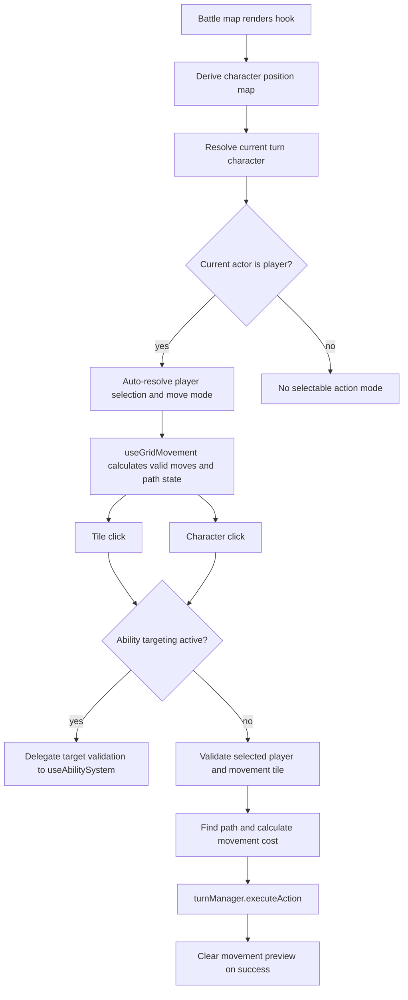

# useBattleMap Hook (`src/hooks/useBattleMap.ts`)

## Purpose

`useBattleMap` coordinates battle-map interaction state for the 2D and 3D combat
map surfaces. It keeps selected-character state, action mode, movement previews,
and ability target clicks aligned with the active turn.

## Lifecycle

## Ownership Boundaries

- `useBattleMap` owns click interpretation, local selection state, action mode,
  and movement preview lifecycle.
- `useGridMovement` owns valid-move and active-path state.
- `useAbilitySystem` owns final spell or ability target validation and feedback.
- `useTurnManager` owns executing movement actions and turn-cost accounting.

## Deferred Risks

- Character positions are rebuilt from the character list each render cycle.
- Pathfinding still recalculates frequently and may need caching if combat maps
  become larger or more dynamic.
- View/camera state is intentionally outside this hook; rendering surfaces should
  keep those concerns local unless a shared map viewport model is introduced.
